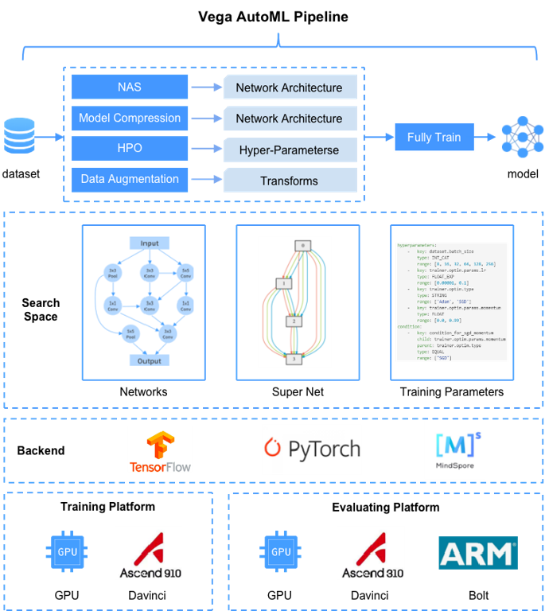

<div align="center">
  
</div>

# Vega

**[English](./README.md) | 中文**

**Vega ver1.3.0 发布：**

- 特性增强：
  - 支持昇腾平台，在Ascend 910搜索和训练（TensorFlow和MindSpore），在Ascend 310上模型评估。
  - 支持在麒麟990上模型评估。
  - 支持用户数据集在DNet预模型上FineTune，在Ascend 910/310上超越SOTA。
  - 支持用户数据集和ResNet类模型的剪枝能力。Cifar100数据集，精度变化较小（+-0.5），时延降低15%，模型大小降低30%。
- 新增算法：
  - ModularNAS: Towards Modularized and Reusable Neural Architecture Search, 支持权重共享和网络变换等方法的神经网络架构搜索算法集。
  - DNet：提供和Davinci芯片亲和的预训练模型，和网络搜索算法。并提供DNet Model Zoo。
  - MF-ASC: Multi-Fidelity neural Architecture Search with Co-kriging.

## Vega简介

Vega是诺亚方舟实验室自研的AutoML算法工具链，有主要特点：

1. 完备的AutoML能力：涵盖HPO(超参优化, HyperParameter Optimization)、Data-Augmentation、NAS(网络架构搜索， Network Architecture Search)、Model Compression、Fully Train等关键功能，同时这些功能自身都是高度解耦的，可以根据需要进行配置，构造完整的pipeline。
2. 业界标杆的自研算法：提供了诺亚方舟实验室自研的 **[业界标杆(Benchmark)](./docs/benchmark.md)** 算法，并提供 **[Model Zoo](./docs/model_zoo.md)** 下载SOTA(State-of-the-art)模型。
3. 高并发模型训练能力：提供高性能Trainer，加速模型训练和评估。
4. 细粒度SearchSpace：可以自由定义网络搜索空间，提供了丰富的网络架构参数供搜索空间使用，可同时搜索网络架构参数和模型训练超参，并且该搜索空间可以同时适用于Pytorch、TensorFlow和MindSpore。
5. 多Backend支持：支持PyTorch(GPU), TensorFlow(GPU, Ascend 910), MindSpore(Ascend 910).。
6. 支持昇腾平台：支持在Ascend 910搜索和训练，支持在Ascend 310上模型评估。

## 算法列表

| 分类 | 算法 | 说明 | 参考 |
| :--: | :-- | :-- | :-- |
| NAS | [CARS: Continuous Evolution for Efficient Neural Architecture Search](https://arxiv.org/abs/1909.04977) | 基于连续进化的多目标高效神经网络结构搜索方法 | [参考](./docs/cn/algorithms/cars.md) |
| NAS | ModularNAS: Towards Modularized and Reusable Neural Architecture Search |  支持权重共享和网络变换等方法的神经网络架构搜索算法集 | [参考](./docs/cn/algorithms/modnas.md) |
| NAS | [MF-ASC](https://dl.acm.org/doi/10.1145/3292500.3330893) | Multi-Fidelity neural Architecture Search with Co-kriging | [参考](./docs/en/algorithms/mfasc.md) |
| NAS | [NAGO: Neural Architecture Generator Optimization](https://arxiv.org/abs/2004.01395) | 基于随机图生成器的，多阶层的神经网络搜索空间 | [参考](./docs/cn/algorithms/nago.md) |
| NAS | SR-EA | 适用于轻量级网络的自动网络架构搜索方法 | [参考](./docs/cn/algorithms/sr_ea.md) |
| NAS | [ESR-EA: Efficient Residual Dense Block Search for Image Super-resolution](https://arxiv.org/abs/1909.11409) | 基于网络架构搜索的多目标图像超分方法 | [参考](./docs/cn/algorithms/esr_ea.md) |
| NAS | [Adelaide-EA: SEGMENTATION-Adelaide-EA-NAS](https://arxiv.org/abs/1810.10804) | 图像分割网络架构搜索算法 | [参考](./docs/cn/algorithms/adelaide_ea.md) |
| NAS | [SP-NAS: Serial-to-Parallel Backbone Search for Object Detection](http://openaccess.thecvf.com/content_CVPR_2020/papers/Jiang_SP-NAS_Serial-to-Parallel_Backbone_Search_for_Object_Detection_CVPR_2020_paper.pdf) | 面向物体检测及语义分割的高效主干网络架构搜索算法 | [参考](./docs/cn/algorithms/sp_nas.md) |
| NAS | [SM-NAS: Structural-to-Modular NAS](https://arxiv.org/abs/1911.09929) | 两阶段物体检测架构搜索算法 | 开发中 |
| NAS | [Auto-Lane: CurveLane-NAS](https://arxiv.org/abs/2007.12147) | 一种端到端的车道线架构搜索算法 | [参考](./docs/cn/algorithms/auto_lane.md) |
| NAS | [AutoFIS](https://arxiv.org/pdf/2003.11235.pdf) | 一种适用于推荐搜索场景下的自动特征选择算法 | [参考](./docs/cn/algorithms/autofis.md) |
| NAS | [AutoGroup](https://dl.acm.org/doi/pdf/10.1145/3397271.3401082) | 一种适用于推荐搜素场景下的自动特征交互建模算法 | [参考](./docs/cn/algorithms/autogroup.md) |
| Model Compression | Quant-EA: Quantization based on Evolutionary Algorithm | 自动混合比特量化算法，使用进化策略对CNN网络结构每层量化位宽进行搜索 | [参考](./docs/cn/algorithms/quant_ea.md) |
| Model Compression | Prune-EA | 使用进化策略对CNN网络结构进行自动剪枝压缩算法 | [参考](./docs/cn/algorithms/prune_ea.md) |
| HPO | [ASHA: Asynchronous Successive Halving Algorithm](https://arxiv.org/abs/1810.05934) | 动态连续减半算法 | [参考](./docs/cn/algorithms/hpo.md) |
| HPO | [TPE: Tree-structured Parzen Estimator Approach](https://papers.nips.cc/paper/4443-algorithms-for-hyper-parameter-optimization.pdf) | 一种基于树状结构Parzen估计方法的超参优化算法  | [参考](./docs/cn/algorithms/hpo.md) |
| HPO | BO: Bayesian Optimization | 贝叶斯优化算法 | [参考](./docs/cn/algorithms/hpo.md) |
| HPO | [BOHB: Hyperband with Bayesian Optimization](https://arxiv.org/abs/1807.01774) | 动态连续减半算法 | [参考](./docs/cn/algorithms/hpo.md) |
| HPO | BOSS: Bayesian Optimization via Sub-Sampling | 基于贝叶斯优化框架下的一种针对计算资源受限，需要高效搜索的，具有普适性的超参优化算法 | [参考](./docs/cn/algorithms/hpo.md) |
| Data Augmentation | [PBA: Population Based Augmentation: Efficient Learning of Augmentation Policy Schedules](https://arxiv.org/abs/1905.05393) | 基于PBT优化算法搜索数据增广策略时刻表的数据增广算法 | [参考](./docs/cn/algorithms/pba.md) |
| Data Augmentation | [CycleSR: Unsupervised Image Super-Resolution with an Indirect Supervised Path](https://openaccess.thecvf.com/content_CVPRW_2020/papers/w31/Chen_Unsupervised_Image_Super-Resolution_With_an_Indirect_Supervised_Path_CVPRW_2020_paper.pdf) | 底层视觉的无监督风格迁移算法 | [参考](./docs/cn/algorithms/cyclesr.md) |
| Fully Train | [FMD](https://arxiv.org/abs/2002.11022) | 基于特征图扰动的神经网络训练方法 | [参考](./docs/cn/algorithms/fmd.md) |

## 安装

执行如下命令安装Vega和相关开源软件：

```bash
pip3 install --user --upgrade noah-vega
```

若需要在Ascend 910训练环境上安装，请联系我们。

## 使用参考

| 对象 | 参考 |
| :--: | :-- |
| [**用户**<br>(用户指南)](./docs/cn/user/README.md) | [安装指导](./docs/cn/user/install.md)、[部署指导](./docs/cn/user/deployment.md)、[配置指导](./docs/cn/user/config_reference.md)、[示例参考](./docs/cn/user/examples.md)、[评估服务](./docs/cn/user/evaluate_service.md)、任务参考([分类](./docs/cn/tasks/classification.md)、[检测](./docs/cn/tasks/detection.md)、[分割](./docs/cn/tasks/segmentation.md)、[超分](./docs/cn/tasks/segmentation.md)) |
| [**开发者**<br>(开发者指南)](./docs/cn/developer/README.md) | [开发者指导](./docs/cn/developer/developer_guide.md)、[快速入门指导](./docs/cn/developer/quick_start.md)、[数据集指导](./docs/cn/developer/datasets.md)、[算法开发指导](./docs/cn/developer/new_algorithm.md)、[细粒度搜索空间指导](./docs/cn/developer/fine_grained_space.md) |

## FAQ

常见问题和异常处理，请参考[FAQ](./docs/cn/user/faq.md)。

## 引用

```text
@misc{wang2020vega,
      title={VEGA: Towards an End-to-End Configurable AutoML Pipeline},
      author={Bochao Wang and Hang Xu and Jiajin Zhang and Chen Chen and Xiaozhi Fang and Ning Kang and Lanqing Hong and Wei Zhang and Yong Li and Zhicheng Liu and Zhenguo Li and Wenzhi Liu and Tong Zhang},
      year={2020},
      eprint={2011.01507},
      archivePrefix={arXiv},
      primaryClass={cs.CV}
}
```

## 合作和贡献

欢迎大家使用Vega，有任何疑问、求助、修改bug、贡献算法、完善文档，请在社区提交issue，我们会及时回复沟通交流。
欢迎大家加入我们的QQ群: **833345709** 。
