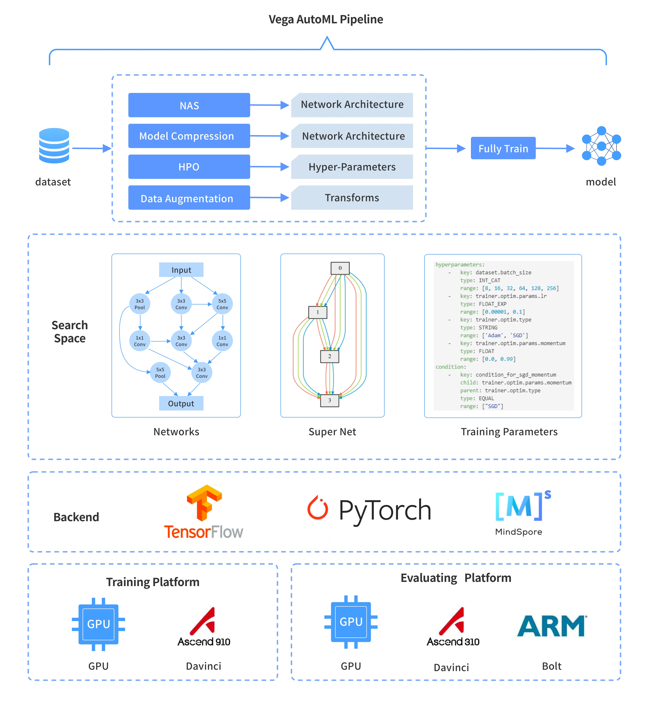

<div align="center">
  
</div>

# Vega

**English | [中文](./README.cn.md)**

---

**Vega ver1.7.1 released**

- Bug fixes:

  - Maximum number of evaluation service attempts.
  - Use SafeLoader to load the YAML file.
  - Catch evaluation service input parameter exceptions.

---

## Introduction

Vega is an AutoML algorithm tool chain developed by Noah's Ark Laboratory, the main features are as follows:

1. Full pipeline capailities: The AutoML capabilities cover key functions such as Hyperparameter Optimization, Data Augmentation, Network Architecture Search (NAS), Model Compression, and Fully Train. These functions are highly decoupled and can be configured as required, construct a complete pipeline.
2. Industry-leading AutoML algorithms: Provides Noah's Ark Laboratory's self-developed **[industry-leading algorithm (Benchmark)](./docs/benchmark.md)** and **[Model Zoo](./docs/model_zoo.md)** to download the state-of-the-art (SOTA) models.
3. Fine-grained network search space: The network search space can be freely defined, and rich network architecture parameters are provided for use in the search space. The network architecture parameters and model training hyperparameters can be searched at the same time, and the search space can be applied to Pytorch, TensorFlow and MindSpore.
4. High-concurrency neural network training capability: Provides high-performance trainers to accelerate model training and evaluation.
5. Multi-Backend: PyTorch (GPU and Ascend 910), TensorFlow (GPU and Ascend 910), MindSpore (Ascend 910).
6. Ascend platform: Search and training on the Ascend 910 and model evaluation on the Ascend 310.

## AutoML Tools Features

|  | Supported Frameworks | HPO Algorithms | NAS Algorithms | Device-Side Evaluation | Model Filter | Universal Network |
| :--: | :-- | :-- | :-- | :-- | :-- | :-- |
| **AutoGluon** | mxnet, PyTorch | Random Search, Bayesian, Hyper-Band | Random Search, RL | × | × | × |
| **AutoKeras** | Keras | No Restrictions | Network Morphism | × | × | × |
| **Model Search** | TensorFlow | No Restrictions | Random Search, Beam Search | × | × | × |
| **NNI** | No Restrictions | Random Search and Grid Search, Bayesian, Annealing, Hyper-Band, Evolution, RL | Random Search, Gradient-Based,  One-Shot | × | × | × |
| **Vega** | PyTorch, TensorFlow, MindSpore | Random Search, Grid Search, Bayesian, Hyper-Band, Evolution | Random Search, Gradient-Based, Evalution, One-Shot | Ascend 310, Kirin 980/990 | Quota (filter model based on parameters, flops, latency) | provides networks compatibility with PyTorch, TensorFlow, and MindSpore |

## Algorithm List

| Category | Algorithm | Description | reference |
| :--: | :-- | :-- | :-- |
| NAS | [CARS: Continuous Evolution for Efficient Neural Architecture Search](https://arxiv.org/abs/1909.04977) | Structure Search Method of Multi-objective Efficient Neural Network Based on Continuous Evolution | [ref](./docs/en/algorithms/cars.md) |
| NAS | ModularNAS: Towards Modularized and Reusable Neural Architecture Search | A code library for various  neural architecture search methods including weight sharing and network morphism | [ref](./docs/en/algorithms/modnas.md) |
| NAS | [MF-ASC](https://dl.acm.org/doi/10.1145/3292500.3330893) | Multi-Fidelity neural Architecture Search with Co-kriging | [ref](./docs/en/algorithms/mfasc.md) |
| NAS | [NAGO: Neural Architecture Generator Optimization](https://arxiv.org/abs/2004.01395) | An Hierarchical Graph-based Neural Architecture Search Space | [ref](./docs/cn/algorithms/nago.md) |
| NAS | SR-EA | An Automatic Network Architecture Search Method for Super Resolution | [ref](./docs/en/algorithms/sr_ea.md) |
| NAS | [ESR-EA: Efficient Residual Dense Block Search for Image Super-resolution](https://arxiv.org/abs/1909.11409) | Multi-objective image super-resolution based on network architecture search | [ref](./docs/en/algorithms/esr_ea.md) |
| NAS | [Adelaide-EA: SEGMENTATION-Adelaide-EA-NAS](https://arxiv.org/abs/1810.10804) | Network Architecture Search Algorithm for Image Segmentation | [ref](./docs/en/algorithms/adelaide_ea.md) |
| NAS | [SP-NAS: Serial-to-Parallel Backbone Search for Object Detection](http://openaccess.thecvf.com/content_CVPR_2020/papers/Jiang_SP-NAS_Serial-to-Parallel_Backbone_Search_for_Object_Detection_CVPR_2020_paper.pdf) | Serial-to-Parallel Backbone Search for Object Detection Efficient Search Algorithm for Object Detection and Semantic Segmentation in Trunk Network Architecture | [ref](./docs/en/algorithms/sp_nas.md) |
| NAS | [SM-NAS: Structural-to-Modular NAS](https://arxiv.org/abs/1911.09929) | Two-stage object detection architecture search algorithm | Coming soon |
| NAS | [Auto-Lane: CurveLane-NAS](https://arxiv.org/abs/2007.12147) | An End-to-End Framework Search Algorithm for Lane Lines | [ref](./docs/en/algorithms/auto_lane.md) |
| NAS | [AutoFIS](https://arxiv.org/pdf/2003.11235.pdf) | An automatic feature selection algorithm for recommender system scenes | [ref](./docs/en/algorithms/autofis.md) |
| NAS | [AutoGroup](https://dl.acm.org/doi/pdf/10.1145/3397271.3401082) | An automatically learn feature interaction for recommender system scenes | [ref](./docs/en/algorithms/autogroup.md) |
| NAS | [MF-ASC](https://dl.acm.org/doi/10.1145/3292500.3330893) | Multi-Fidelity neural Architecture Search with Co-kriging | [ref](./docs/en/algorithms/mfasc.md) |
| Model Compression | Quant-EA: Quantization based on Evolutionary Algorithm | Automatic mixed bit quantization algorithm, using evolutionary strategy to quantize each layer of the CNN network | [ref](./docs/en/algorithms/quant_ea.md) |
| Model Compression | Prune-EA | Automatic channel pruning algorithm using evolutionary strategies | [ref](./docs/en/algorithms/prune_ea.md) |
| HPO | [ASHA: Asynchronous Successive Halving Algorithm](https://arxiv.org/abs/1810.05934) | Dynamic continuous halving algorithm | [ref](./docs/en/algorithms/hpo.md) |
| HPO | [BOHB: Hyperband with Bayesian Optimization](https://arxiv.org/abs/1807.01774) | Hyperband with Bayesian Optimization | [ref](./docs/en/algorithms/hpo.md) |
| HPO | BOSS: Bayesian Optimization via Sub-Sampling | A universal hyperparameter optimization algorithm based on Bayesian optimization framework for resource-constraint hyper-parameters search | [ref](./docs/en/algorithms/hpo.md) |
| Data Augmentation | [PBA: Population Based Augmentation: Efficient Learning of Augmentation Policy Schedules](https://arxiv.org/abs/1905.05393) | Data augmentation based on PBT optimization  | [ref](./docs/en/algorithms/pba.md) |
| Data Augmentation | [CycleSR: Unsupervised Image Super-Resolution with an Indirect Supervised Path](https://openaccess.thecvf.com/content_CVPRW_2020/papers/w31/Chen_Unsupervised_Image_Super-Resolution_With_an_Indirect_Supervised_Path_CVPRW_2020_paper.pdf) | Unsupervised style migration algorithm for low-level vision problem. | [ref](./docs/en/algorithms/cyclesr.md) |
| Fully Train | [Beyond Dropout: Feature Map Distortion to Regularize Deep Neural Networks](https://arxiv.org/abs/2002.11022) | Neural network training (regularization) based on disturbance of feature map | [ref](./docs/en/algorithms/fmd.md) |
| Fully Train | [Circumventing Outliers of AutoAugment with Knowledge Distillation](https://arxiv.org/abs/2003.11342v1) | Joint knowledge distillation and data augmentation for high performance classication model training, achieved 85.8% Top-1 accuracy on ImageNet 1k | Coming soon |

## Installation

Run the following commands to install Vega and related open-source software:

```bash
pip3 install --user --upgrade noah-vega
```

If you need to install the Ascend 910 training environment, please contact us.

## Usage

Run the `vega` command to run the Vega application. For example, run the following command to run the `CARS` algorithm:

```bash
vega ./examples/nas/cars/cars.yml
```

The `cars.yml` file contains definitions such as pipeline, search algorithm, search space, and training parameters.
Vega provides more than 40 examples for reference: [Examples](https://github.com/huawei-noah/vega/tree/master/examples), [Example Guide](./docs/en/user/examples.md), and [Configuration Guide](./docs/en/user/config_reference.md).

## Reference

| object | refrence |
| :--: | :-- |
| [**User**<br>(User Guide)](./docs/en/user/README.md) | [Install Guide](./docs/en/user/install.md), [Deployment Guide](./docs/en/user/deployment.md), [Configuration Guide](./docs/en/user/config_reference.md), [Examples](./docs/en/user/examples.md), [Evaluate Service](./docs/en/user/evaluate_service.md) |
| [**Developer**<br>(Developer Guide)](./docs/en/developer/README.md) | [Development Reference](./docs/en/developer/developer_guide.md), [Quick Start Guide](./docs/en/developer/quick_start.md), [Dataset Guide](./docs/en/developer/datasets.md), [Algorithm Development Guide](./docs/en/developer/new_algorithm.md), [Fine-Grained Search Space Guide](./docs/en/developer/fine_grained_space.md) |

## FAQ

For common problems and exception handling, please refer to [FAQ](./docs/en/user/faq.md).

## Citation

```text
@misc{wang2020vega,
      title={VEGA: Towards an End-to-End Configurable AutoML Pipeline},
      author={Bochao Wang and Hang Xu and Jiajin Zhang and Chen Chen and Xiaozhi Fang and Ning Kang and Lanqing Hong and Wei Zhang and Yong Li and Zhicheng Liu and Zhenguo Li and Wenzhi Liu and Tong Zhang},
      year={2020},
      eprint={2011.01507},
      archivePrefix={arXiv},
      primaryClass={cs.CV}
}
```

## Cooperation and Contribution

Welcome to use Vega. If you have any questions or suggestions, need help, fix bugs, contribute new algorithms, or improve the documentation, submit an issue in the community. We will reply to and communicate with you in a timely manner.  
Welcome to join our QQ chatroom (Chinese): **833345709**.
