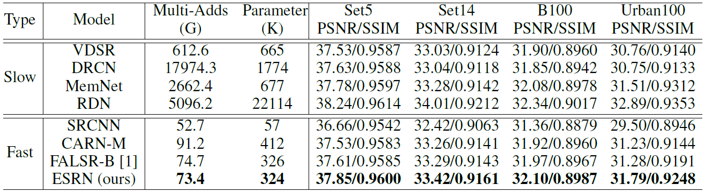

# Efficient Residual Dense Block Search for Image Super-resolution (ESR_EA)

## 1. 算法介绍

图像超分的主要目标是将图片从低分辨率恢复到高分辨率图像，在拍照、安防、医疗影像等场景中具有广泛的应用价值。得益于GPU和深度卷积网络（DCNN）的快速发展，图像超分的视觉效果得到大幅提高，这促使图像超分在现实生活中得到广泛的应用。

与此同时，网络模型也越来越大，从57K增加到现在的43M，计算量更是达到了10192G FLOPs (RDN)。但是移动设备的计算性能和存储空间都非常有限，巨大的参数量和计算量严重限制了超分模型在移动设备（例如，手机、摄像头、智能家居）上的应用。因此，设计轻量级超分模型对终端具有巨大的价值。

常见的超分模型小型化的方法主要分为两类，一是设计高效的结构单元（如group convolution、recuresive等），二是使用网络结构搜索获得轻量级超分网络。现有算法主要以卷积单元和连接为基础，搜索轻量级网络。但是这种方式获得的网络结构非常不规则，对硬件不友好。另一方面，整个主干网络都在一个尺度上计算，网络的计算量很大。

该算法以模块为基础构建搜索空间，以参数量和计算量为约束，网络准确性（PSNR）为目标，搜索轻量快速的超分网络结构。这样以模块为基础搜索得到的网络结构对硬件比较友好。除此之外，该算法从通道方面、卷积方面和特征尺度三个角度全方面压缩超分网络冗余信息，该论文已经发表在AAAI 2020会议上[1]。

```text
[1] Song, D.; Xu, C.; Jia, X.; Chen, Y.; Xu, C.; Wang, Y. Efficient Residual Dense Block Search for Image Super-Resolution[C]. AAAI 2020.
```

## 2. 算法原理

该算法的目标是搜索轻量级、快速准确的超分网络结构。首先，为了硬件友好，该算法以模块以基础构建搜索空间，以参数量和计算量为约束，网络准确性（PSNR）为目标，搜索高效的超分网络结构。除此之外，还以RDB为基础设计了高效超分模块，分别从通道方面、卷积方面和特征尺度方面压缩超分网络冗余信息。最终以遗传算法搜索各个类型模块的数目、相应位置以及具体的内部参数。这样可以自动分配不同方面冗余压缩的程度。具体的算法框架示意图如下：


该算法以RDN为整体结构框架，以Efficient RDB（Residual Dense Block）为基本单元结构，对网络结构的模块数目、模块的类型以及模块内部参数进行搜索；通过网络结构搜索具体确定各个方面压缩的程度，以及每种模块所在的位置。该算法设计了三种高效的残差密集模块，分别压缩模块通道方面、卷积方面和特征尺度方面的冗余，其具体结构如下：


该算法主要分为两个过程：网络结构搜索和完全训练；为了加快搜索速度，网络结构搜索过程中的模型评价一般采用快速训练的方式；因此要获得最终的模型，还需要在网络结构搜索之后进行大数据集的完整训练。

搜索过程中输出的网络结构示例：

```text
['G_8_16_24', 'C_8_16_16', 'G_4_16_24', 'G_8_16_16', 'S_4_24_32', 'C_8_16_48', 'S_4_16_24', 'G_6_16_24', 'G_8_16_16', 'C_8_16_24', 'S_8_16_16', 'S_8_16_24', 'S_8_16_32', 'S_6_16_16', 'G_6_16_64', 'G_8_16_16', 'S_8_16_32']
```

### 2.1 搜索空间和搜索策略

在搜索空间中，既定算法以Efficient RDB为基本结构单元，考虑到硬件的效率，卷积通道数目的搜索也是以16的倍数为基本选型，例如：16, 24, 32, 48, 64等。该算法主要搜索模块的数目、每个位置模块的类型以及模型内部的具体参数（卷积数目，通道数目等），通过搜索的方式分配各个方面压缩的程度。

搜索策略方面主要以进化算法为主，首先以RDN为基本结构框架对网络全局进行编码，通过交叉和变异产生下一代种群，并根据种群个体的适应度选择精英个体。在算法中提供了两种交叉操作父母的选择方式，分别为锦标赛方式和轮盘赌的方式。通过反复迭代进化，获得优良的网络结构。

### 2.2 配置搜索空间和搜索参数

在配置文件中进行参数配置，可参考示例代码中的配置文件`examples/nas/esr_ea/esr_ea.yml`。

其中：

```yaml

nas:
    search_space:                       # 网络结构搜索参数设置
        type: SearchSpace
        modules: ['esrbody']
        esrbody:
            type: ESRN
            block_type: [S,G,C]         # 模块的类型
            conv_num: [4,6,8]           # 模块内包含的卷积数目
            growth_rate: [8,16,24,32]   # 模块内的卷积的通道数目
            type_prob: [1,1,1]          # 模块类型选择的概率
            conv_prob: [1,1,1]          # 卷积数目的选择概率
            growth_prob: [1,1,1,1]      # 卷积通道的选择概率
            G0: 32                      # 初始卷积通道数目
            scale: 2                    # 超分的尺度
    search_algorithm:
        type: ESRSearch
        codec: ESRCodec
        policy:
            num_generation: 20          # 进化算法的迭代次数
            num_individual: 8           # 每个种群的个体数目
            num_elitism: 4              # 选择保留的精英数目
            mutation_rate: 0.05         # 每个基因变异的概率
        range:
            node_num: 20                # 网络模块数目的上限
            min_active: 16              # 网络包含的模块数目的下限
            max_params: 325000          # 网络包含参数量的最大值
            min_params: 315000          # 网络包含参数量的最小值
```

目前的搜索空间主要以Efficient RDB为基本结构，可以扩充其他的block作为基本单元结构或者多种block一起搜索。

## 3. 适用场景

本方法用来搜索low level vision任务，如超分，去噪，去马赛克等，以RDN为主体结构搜索轻量级的网络结构。目前使用的数据是RGB域的Single Image数据，包括DIV2K等，其他类似的数据集可以更换。

## 4. 使用指导

可参考示例代码`examples/nas/esr_ea`，在该文件夹下，文件`esr_ea.yml`配置了运行ESR代码所需的所有信息，其中除了上个章节所描述的`search_space`和`search_algorithm`外，还需要注意一下配置：

若希望加快搜索速度，或在运行较长时间的搜索和训练之前先进行代码调测，可以减少以下文件的参数的数值：

```yaml
nas:
    search_algorithm:
        policy:
            num_generation: 20      # 进化算法的迭代次数
            num_individual: 8       # 每个种群的个体数目
    trainer:                        # 搜索过程中模型训练的参数设置
        epochs: 500                 # 训练迭代次数
```

若希望提高模型的精度，可以尝试增大以下参数：

```yaml
nas:
    search_algorithm:
        policy:
            num_generation: 20      # 进化算法的迭代次数
            num_individual: 8       # 每个种群的个体数目
    trainer:                        # 搜索过程中模型训练的参数设置
        epochs: 500                 # 训练迭代次数

fully_train:
    trainer:                        # 完整过程中模型训练的参数设置
        epochs: 15000               # 训练迭代次数
        lr_scheduler:
            type: MultiStepLR
            milestones: [8000,12000,13500,14500]    # 学习率衰减位置
            gamma: 0.5
```

并在网络结构搜索完的文件中，可以选择最优的一个也可以选择最优的N个进行完整训练，使用多个网络训练一般可以获得更好是效果。

在调整了以上参数后，请参考[示例参考](../user/examples.md)，运行程序。

## 5. 算法输出

本方法在运行结束后，基于默认配置，可以达到下图的结果：



```text
[1] Chu, X.; Zhang, B.; Ma, H.; Xu, R.; Li, J.; and Li, Q. 2019. Fast, accurate and lightweight super-resolution with neural architecture search. arXiv preprint arXiv:1901.07261.
```
