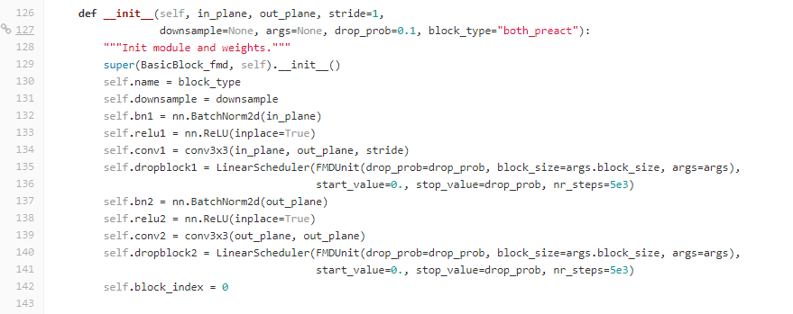
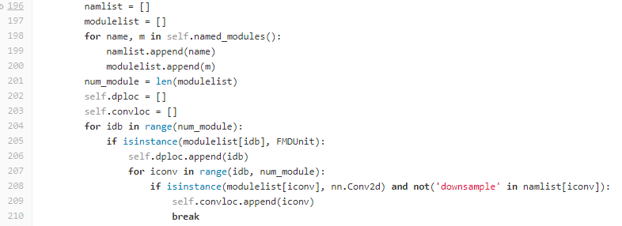
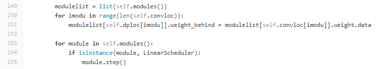

# A Guidance of Feature Map Distortion (FMD)

## 1. 介绍

深度神经网络在计算机视觉、自然语言处理、语音等领域中被广泛使用，并在自动驾驶、机器翻译、目标检测等多个实际应用中获得了成功。深度神经网络通常会存在大量的冗余参数，这在提高了网络在训练集的分类精度的同时，导致了过拟合问题，使得网络的泛化性降低，即在测试集与训练集上的分类精度差距变大。许多研究提出了各种方法来缓解过拟合问题，能够在不明显减低训练集分类精度的前提下，缩小测试集与训练集之间的分类精度差距，从而提高神经网络的性能。

现有大量关于缓解过拟合问题的研究，其中最为广泛使用的方法为正则化方法中的随机失活(Dropout)方法。近年来，许多基于随机失活的变种方法被提出，使用这些方法能够得到好的结果。然而，这些研究存在以下问题。随机失活操作随机舍弃神经网络中的部分神经元，并把对应神经元的输出置0，这种将输出置0的操作是一种手工定义的操作，在提高网络泛化能力的同时极大地破坏了网络的表示能力。

除了直接的置0操作，可以对神经元输出做更加灵活的扰动，在尽量少地破坏网络表示能力的同时，有效地降低了模型的复杂程度，从而提高网络的泛化能力并减轻过拟合现象。因此，本方法关注如何对神经元输出进行扰动来缓解过拟合现象，得到具有更佳泛化能力的深度神经网络。

本方法综合考虑了现有方法的不足，提出一种灵活通用的神经元输出扰动方法。在训练过程中，交替优化网络参数和扰动项：网络参数通过最小化通用损失函数（比如分类问题中的交叉熵损失函数）进行优化；给定当前的网络参数，通过最小化经验rademacher复杂度优化得到扰动项，并使用当前得到的扰动项干扰下一次迭代中网络的前向传递过程。实验结果显示，使用神经元输出扰动方法训练得到的网络，在测试集上有更好的性能。


本方法可以看成一个代替dropout的算子，一般用在convolution层之后（可以在conv层后接入bn层或relu层再加入本算子），主要用于分类任务场景。

## 2. 算子介绍

FMD算子相关的参数如下：

| 参数 | 说明 |
| :-- | :-- |
| drop_prob  | 即扰动神经元的概率。 |
| alpha | 用于调整扰动的强度 |
| block_size | 具体实现中，可以每次同时扰动block_size * block_size大小的神经元块。 |

**drop scheduler**主要用于调整drop率。具体为从start_value开始，通过nr_steps步达到预设的drop值。其定义在

所需传入参数如下：

```yaml
dropblock: 关于FMD算子的实例化。
start_value: drop率初始值。
stop_value: drop率最终值。
nr_steps: 从初始值达到最终值的所需步数。
```

## 3. 示例

利用FMD算子构建神经网络的相关代码实例位于：

```text
examples/fully_train/fmd/networks/resnet_cifar.py
```

该示例代码展示了在resnet网络中增加fmd算子，并使用改进后的网络在cifar10数据集上进行分类。

请将配置文件配置正确后，调用主函数运行pipeline，请参考[示例参考](../user/examples.md)。

该示例的默认参数在cifar10数据集中达到94.50%的精度。原论文中所展示的精度值如下：

  

若希望细致的调整参数，达到原文的精度。可以考虑调整.yml文件中model下的drop_prob, alpha和block_size三个参数。

## 4. 自定义网络结构

用户可能需要自定义网络结构。自定义的网络结构的.py文件应放在networks文件夹中，并将相应的网络命名在yml配置文件中进行修改。

关于网络的定义，参考resnet_cifar.py文件。关于fmd算子的调用参考第135行。



   另外需要对网络的init操作和forward操作进行一定的修改。具体的，init方法中参考196-210行，含义为关于fmd层参数和conv层参数的记录。



   foward方法中参考249-255行，含义为对fmd层的weight_behind参数赋值，并调整drop率，使得drop率从0最终变化到设定值。


