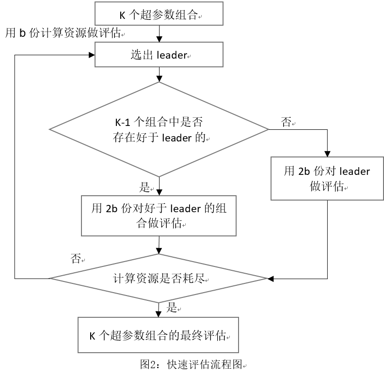
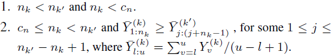
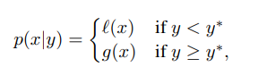
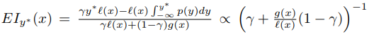

# HPO

## 1. 超参优化功能介绍

超参数优化，是指用自动化的算法来优化原机器学习/深度学习算法中无法通过训练来优化的超参数，如学习率、激活函数、优化器等。在训练神经网络的时候，调节超参数是必不可少的，这个过程可以更科学地训练出更高效的机器学习模型。现阶段的模型训练需要有经验的研究员/工程师根据现有的信息来判断出所要修改的超参数，但是对于大部分人而言，这是个十分费时费力的过程。

使用自动超参数优化能力，对于普通用户，可以快速高效地在超参数空间中测试选择最佳的超参数组合，节省大量人力和时间；对于高级研究用户，可以根据经验定义出更准确的小范围超参数搜索空间，并自动进行快速超参数搜索，从而能够在现有基础上进一步提升模型训练效果。

当前已有的算法适用于常见的深度神经网络的超参数优化，包括单目标优化，和随机帕累托的多目标超参选择。单目标优化算法适用于模型评估标准唯一，或可以用单一指标综合表述模型性能的优劣的情况。多目标帕累托优化算法适用于需要用多指标综合表示模型的优劣情况，算法最终会给出满足帕累托前沿的一系列超参数组合。

当前Vega已提供如下超参优化算法：

| algorithm | Single-objective HPO | Multi-objective HPO |
| :--: | :--: | :--: |
| Random | √ | √ |
| ASHA | √ | √ |
| BOHB | √ | √ |
| BOSS | √ | × |
| PBT | √ | × |

## 2. 超参数优化算法简介

### 2.1 深度神经网络的超参数优化简介

**有效地学习深层神经网络的参数是一个具有挑战性的问题：**

1. 超参数优化是一个组合优化问题，无法像一般参数那样通过梯度下降方法来优化，也没有一种通用有效的优化方法；
2. 评估一组超参数配置的时间代价非常高，从而导致一些优化方法（比如进化算法）在超参数优化中难以应用。

**常见超参数优化的一些方法：**

1. 网格搜索   (Grid Search)
2. 随机搜索  (Random Search)
3. 贝叶斯优化 (Bayesian Optimization)
4. 动态资源分配 (Dynamic Resource Allocation)

### 2.2 关于动态资源分配HPO

**基于动态资源分配的超参优化:**

目前神经网络的优化方法一般都采取随机梯度下降，可以通过一组超参数的学习曲线和当前验证指标结果来预估这组超参数是否有希望得到比较好的结果。如果认为一组超参数比较差，我们可以应用早停策略（early-stopping）来中止当前的训练。

**优势：**

- 不同于传统的随机搜索或贝叶斯优化，动态资源分配方法更适用于深度神经网络的超参数优化，因为深度神经网络的训练需要大量的时间、多次的迭代、消耗大量的计算资源；
- 动态资源分配能在更少的资源消耗和更短的时间内搜到相对更好的超参数组合；
- 可以使用多GPU异步并行搜索最优超参数组合。

**用途：**

- 通过大量计算直接获取最优的超参数组合；
- 在备选的少量超参数中快速计算选择最优的超参数；
- 可用于衔接架构搜索，对搜索得到的网络架构进一步搜索适用于其的超参数组合。

**基于早停策略的动态资源分配的常见超参优化算法：**

- Successive Halving Algorithm (SHA).
- Asynchronous Successive Halving Algorithm (ASHA).
- Bandit-Based Hyperparameter Optimization (HyperBand).
- Hyperband with Bayesian Optimization (BOHB).
- Population Based Training (PBT).

## 3. 搜索空间介绍

当前在Vega Pipeline中提供了一种通用的、可由独立离散或连续变量构成的搜索空间，并可以设置变量之间的条件约束关系等。

当前搜索空间支持的变量类型和变量间条件约束包括：

1. **变量类型**

连续变量：

- [x] INT
- [x] INT_EXP
- [x] FLOAT
- [x] FLOAT_EXP

离散变量：

- [x] INT_CAT
- [x] FLOAT_CAT
- [x] STRING
- [x] BOOL

2. **条件约束类型**

- [x] EQUAL
- [x] NOT_EQUAL
- [x] IN

### 3.1 HyperparameterSpace

HyperparameterSpace的设计是以Hyperparameter和Condition为基础的，可以理解HyperparameterSpace为一个容器，可以将多种超参数和关联关系装在其中。

HyperparameterSpace中实现了一个DAG的框架，能够在HyperparameterSpace创建是生成一个有向无环图，并随着Hyperparameter的加入，向该DAG增加节点；随着Condition的加入，向该DAG加入有向边。其中加入有向边的同时利用DAG的原理检测当前DAG的有效性，如果发现不满足DAG属性则报错，从而保证超参间关联关系的有向无环特征。

**HyperparameterSpace最重要的功能即提供Sampling：**当前支持均匀随机采样。主要用于向随机搜索或贝叶斯优化提供超参空间的样本。具体做法为，首先获取每个超参数的范围（category类的超参在Hyperparameter内会映射到一个[0,1]的连续空间），然后根据采样数目n（当前默认为1000），为每个超参在其range上进行随机，得到一个shape为n*d的Matrix，其中n为采样数目，d为超参数个数。然后将该采样的Matrix交给后续的搜索算法进行搜索，该采样空间可以随时重新采样更新，从而保证样本的随机性和区域覆盖。

**HyperparameterSpace还提供inverse_transform功能：**该功能用途为，当后续的搜索算法搜到一个合适的param组合（即采样Matrix中的一行时），反向得到该param组合对应的真实的能直接交给建模方法的超参数组合（应该是一个name->value的python字典）。实现方法为：获取当前选中的param组合，即一个param_list，然后根据HyperparameterSpace中的DAG，先提出所有的无parent节点，反向得到其真实值；然后从这些node出发，广度优先搜索DAG，按每条边上的Condition计算该边在当前param_list情况下的返回值是True还是False，从而决定真实超参组合是否要包含该Child节点。遍历结束即得到最终的真实超参数组合，并提供给训练服务使用。

### 3.2 Hyperparameter

整体架构：


Hyperparameter主要提供对每种超参数的名称、类型和具体超参范围的存储功能，并将超参范围映射到一个能够计算的均匀数值范围内。这里主要面向EXP和CAT结尾的超参数类型，主要做法为对EXP类型的超参数进行log后确定其范围，而CAT类型的需要进行按照类型的数量，映射到[0,1]区间内的不同范围。

Hyperparameter还提供对每个超参数的反向映射，即接收到搜索算法返回的param_list对于每个超参的一个数值时，从该数值映射回真实的超参值。主要是用于CAT和EXP类型的超参数。

在参数映射中，Hyperparameter会采用动态的参数映射方法。

### 3.3 Condition

整体架构：


Condition主要提供对超参数之间的关联关系的管理功能。具体的每个超参数关系需要一个child和一个parent对应，即某个超参数child当前是否选择，取决于parent的当前取值是否满足一定条件。

当前提供的条件包括：EQUAL，NOT_EQUAL，IN

这里用一个condition_range来传入条件的值或者范围。具体的：

- EQUAL类：condition_range只能包含一个parent的数值，表示child被选择，需要满足parent的值**等于**该数值；
- NOT_EQUAL类：condition_range可以包含一个或多个parent的数值，表示child被选择，需要满足parent的值**不等于**condition_range中的提供的所有数值；
- IN类：如果parent是range类型的，则condition_range必须包含两个值表示该cond_range的最小值和最大值，child被选中必须满足parent当前值落在该cond_range范围内；如果parent是CAT类型的，则condition_range必须包含一个或者多个parent数值，child被选中必须满足parent当前值落在condition_range中的某个数值上。

## 4. 使用指导

### 4.1 Example

我们结合example中的asha_hpo示例来介绍如何使用HPO模块。该example主要包含配置文件：asha.yaml 。

#### 配置文件asha.yaml

```yaml
pipeline: [hpo]

hpo:
    search_algorithm:
        type: AshaHpo
        policy:
            total_epochs: 20

    search_space:
        type: SearchSpace
        hyperparameters:
            -   key: dataset.batch_size
                type: CATEGORY
                range: [8, 16, 32, 64, 128, 256]
            -   key: trainer.optimizer.params.lr
                type: FLOAT_EXP
                range: [0.00001, 0.1]
            -   key: trainer.optimizer.type
                type: CATEGORY
                range: ['Adam', 'SGD']
            -   key: trainer.optimizer.params.momentum
                type: FLOAT
                range: [0.0, 0.99]
        condition:
            -   key: condition_for_sgd_momentum
                child: trainer.optimizer.params.momentum
                parent: trainer.optimizer.type
                type: EQUAL
                range: ["SGD"]
```

`config_count`表示总共会采样的超参数组合的个数，在ASHA算法中`total_epochs`表示每个模型最多会训练多少epochs，`hyperparameters`为设置当前的超参搜索空间，其中的`"condition"`部分表示当前子超参`"child": "sgd_momentum"`只有在`"parent": "optimizer"`等于`"SGD"`的时候才会被选中。

下面需要配置trainer的部分：

```yaml
hpo:
    model:
        model_desc:
            modules: ["backbone"]
            backbone:
                type: ResNet
                depth: 18
                num_class: 10
    trainer:
        type: Trainer
        epochs: 1
        optim:
            type: Adam
            lr: 0.1
        lr_scheduler:
            type: MultiStepLR
            milestones: [75, 150]
            gamma: 0.5
        metric:
            type: accuracy
        loss:
            type: CrossEntropyLoss
```

### 4.2 输出

#### 运行Example

执行如下命令：

```bash
vega ./hpo/asha/asha.yml
```

#### 计分板 score_board

在日志中会打印不同采样的rung_id，超参数的config_id，以及当前该id对应的训练任务的运行状态，还有单目标优化的performance的score，具体如下表所示:

| rung_id | config_id | status              | score    |
| ------- | --------- | ------------------- | -------- |
| 0       | 0         | StatusType.FINISHED | 1.6      |
| 0       | 1         | StatusType.FINISHED | 12.78261 |
| 0       | 2         | StatusType.FINISHED | 1.2208   |
| 0       | 3         | StatusType.FINISHED | 3.198976 |
| 0       | 4         | StatusType.FINISHED | 12.78772 |

#### hps.json

如下所示，在单目标优化下，即选择当前最高score的超参数组合:

```json
{
    "trainer": {
        "epochs": 1,
        "optimizer": {
            "params": {
                "momentum": 0.8254907348201684,
                "lr": 0.07
            },
            "type": "SGD"
        }
    },
    "dataset": {
        "batch_size": 256
    }
}
```

## 5. 附录

### 6.1 ASHA算法介绍

<https://arxiv.org/abs/1810.05934>

<https://blog.ml.cmu.edu/2018/12/12/massively-parallel-hyperparameter-optimization/>

基于动态资源分配的超参优化算法最早以SHA算法出现，即连续减半算法。基础思想为：由于深度神经网络训练迭代次数多，每次的训练时间很长，所以对多组超参数，每轮训练少量步数，然后对所有超参进行一轮评估和排序，将排在后半部分的超参数对应的训练全部早停终止，然后再对剩余的超参进行下一轮评估（从上一轮暂存的checkpoint 加载上一轮的模型继续训练），然后再评估再减半，直到达到优化目标。

具体操作：

1. 选定初始资源（这里的资源为训练步数），在当前轮（第一轮first rung）给所有超参组合分配该初始资源；
2. 对所有超参组合利用其分配的资源进行训练和评估；
3. 将排序靠前一般的超参提升到下一轮（next rung）；
4. 在新的一轮将资源加倍（训练步数加倍，或以一定策略增加），分配给该轮内的所有超参，然后再迭代，直到到达优化目标。


以上是SHA的具体操作和思想，其中的问题在于其是一个序列化或者可以同步并行的操作，必须等待同一轮的所有超参训练评估结束后才能进入下一轮，所以提出了异步并行的算法ASHA。ASHA算法自底向上生长，不需要评估所有一轮才promote下一轮候选者，而是在当前轮进行中同时进行下一轮评估，不断同步生长的过程，能够异步并行，极大提升优化效率。


由于ASHA的异步并行的对资源的高效利用，使得该算法在资源较多的情况下能够极大加速HPO的过程。

### 6.2 HyperBand算法介绍

[Hyperband: Bandit-Based Configuration Evaluation for Hyperparameter Optimization](https://openreview.net/pdf?id=ry18Ww5ee)


- $r$: 单个超参数组合**实际**所能分配的预算；
- $R$: 单个超参数组合所能分配的**最大**预算；
- $s_{max}$: 用来控制总预算的大小。上面算法中$s_{max} = \lfloor log_{\eta}(R) \rfloor$，当然也可以定义为$s_{max} = \lfloor log_{\eta}(n_{max}) \rfloor$；
- $B$: 总共的预算 $B=(s_{max}+1)R$；
- $\eta$: 用于控制每次迭代后淘汰参数设置的比例；
- get_hyperparameter_configuration(n): 采样得到n组不同的超参数设置；
- run_then_return_val_loss($t$,$r_i$):根据指定的参数设置和预算计算valid loss。$L$表示在预算为$r_i$的情况下各个超参数设置的验证误差；
- topk( $T, L, \lfloor n_i/\eta \rfloor$ ):第三个参数表示需要选择top k(k=$\lfloor n_i/\eta \rfloor$)参数设置。

**hyperband 示例：**

文中给出了一个基于MNIST数据集的示例，并将迭代次数定义为预算(Budget),即一个epoch代表一个预算。超参数搜索空间包括学习率，batch size,kernel数量等。

令R=81,η=3R=81,η=3，所以smax=4,B=5R=5×81smax=4,B=5R=5×81。

下图给出了需要训练的超参数组和数量和每组超参数资源分配情况。

由算法可以知道有两个loop，其中inner loop表示SuccessiveHalving算法。再结合下图左边的表格，**每次的inner loop，用于评估的超参数组合数量越来越少，与此同时单个超参数组合能分配的预算也逐渐增加**，所以这个过程能更快地找到合适的超参数。

右边的图给出了不同ss对搜索结果的影响，可以看到s=0s=0或者s=4s=4并不是最好的，所以并不是说ss越大越好。


### 6.3 BOHB算法介绍

注意上述HyperBand算法中对超参数设置采样使用的是均匀随机采样，所以有算法在此基础上结合贝叶斯进行采样，提出了[BOHB:Practical Hyperparameter Optimization for Deep Learning](http://proceedings.mlr.press/v80/falkner18a/falkner18a.pdf)

BOHB 是由[此篇论文](https://arxiv.org/abs/1807.01774)提出的一种高效而稳定的调参算法。 BO 是贝叶斯优化（Bayesian Optimization）的缩写，HB 是 Hyperband 算法的缩写。

BOHB 依赖 HB（Hyperband）来决定每次跑多少组参数和每组参数分配多少资源（budget），**它的改进之处是将 Hyperband 在每个循环开始时随机选择参数的方法替换成了依赖之前的数据建立模型（贝叶斯优化）进行参数选择**。 一旦贝叶斯优化生成的参数达到迭代所需的配置数, 就会使用这些配置开始执行标准的连续减半过程（successive halving）。 观察这些参数在不同资源配置（budget）下的表现 g(x, b)，用于在以后的迭代中用作我们贝叶斯优化模型选择参数的基准数据。

接下来分两部分来介绍 BOHB 过程涉及的原理:

#### HB(HyperBand)

按照 Hyperband 的方式来选择每次跑的参数个数与分配多少资源（budget），并继续使用“连续减半（SuccessiveHalving）”策略：


#### BO(贝叶斯优化)

BOHB 的 BO 与 TPE 非常相似, 它们的主要区别是: BOHB 中使用一个多维的 KDE, 而不是 TPE 那样带有权重的一维 KDEs, 以便更好地处理搜索空间中超参之间的互相影响。

树形超参评估器 (TPE): 使用 KDE (核密度估计) 来对密度进行建模。


为了建模有效的核密度估计（KDE），设置了一个建立模型所需的最小观察点数（Nmin），在 Experiment 中它的默认值为 d+1（d是搜索空间的维度），其中 d 也是一个可以设置的超参数。 因为希望尽早地建立模型，所以当 Nb = |Db|，即当已经观察到的计算资源（budget）为 b 的点数满足 q · Nb ≥ Nmin 时，立即建立模型来指导之后参数的选择。所以，在使用了刚开始Nmin + 2 个随机选择的参数之后，会按照下式将观察到的点进行分类


### 6.4 BOSS算法介绍

BOSS全称Bayesian Optimization via Sub-Sampling，是基于贝叶斯优化框架下的一种针对计算资源受限，需要高效搜索的，具有普适性的超参优化算法。其核心是对超参数组合自适应分配计算资源训练的方案。BOSS算法的最终输出为一个最优的超参组合，在该组合下，充分训练之后，可以得到最佳模型。其中人为因素主要集中在预定义搜索空间，即每个超参数的取值范围。BOSS搜索框架如下：

1. 选定需要搜索的超参数，以及各自的取值范围；
2. 随机抽取一批超参组合；
3. 对这批超参组合使用Sub-Sampling算法分配计算资源（训练神经网络的迭代次数，或蒙特卡罗方法的取样个数），得到每一个组合相对应的表现指标；
4. 通过新加入的这批数据更新贝叶斯模型（TPE模型），并从校正后的模型中抽取下一批超参组合；
5. 不断重复步骤3-4，直到达到指定的轮数或满意的表现指标。

#### 算法原理

我们现在使用的各种神经网络，再经由数据，通过某种学习算法训练后，便得到了一个可以用来进行预测，估计的模型，如果这个模型表现的不好，有经验的工作者便会调整网络结构,算法中学习率或是每批处理的样本的个数等不通过训练得到的参数，一般称之为超参数。工作者们通过大量实践经验来调整超参数，使得最后的模型表现更为优秀，直到其精度可以被接受来真正使用它。更为具体来说，机器学习算法中的参数是用来调整数据的。深度神经网络由许多神经元组成，输入的数据通过这些神经元来传输到输出端。在神经网络训练时候，每个神经元的权重会随着损失函数的值来优化从而减小损失函数的值。这样便可以通过算法来优化参数得到模型。而超参数是用来调节整个网络训练过程的，例如神经网络的隐藏层的数量，核函数的大小，数量等等。超参数并不直接参与到训练的过程中，他们只是配置变量。需要注意的是在训练过程中，参数是会更新的而超参数往往都是恒定的。不同的模型对不同的问题，会有不同的最优超参数组合，以往工作者们会根据自身的工作经验来进行调参，这往往是一个工作量巨大，耗时缓慢的过程，因为用一组超参数训练一个模型可能需要几分钟、几小时、几天、甚至几个月的时间。所以超参数优化自动化是一项急需的关键技术，它可以帮助:

- 减少机器学习中人工参与调参的成本，真正实现自动自治化的机器学习，这是在AutoML中最为重要的一个需求。
- 提升机器学习算法的性能，使得自动优化超参数后的算法成为当前领域新的最好的算法。
- 对于科学研究而言，提升其可重复性和公平性。使用自动化的超参数优化要比手工搜索更容易让他人复现。并且，算法之间的公平比较也是建立在双方所受到的调参程度是相同的，而手工调参往往不能令人信服。

BOSS算法基础框架使用贝叶斯优化，如下图所示：


贝叶斯优化假设初始模型，去选取模型下最优可能符合预设条件的超参组合，观察是否满足条件，如果满足则过程终止，如果不满足，则利用该组新数据修正模型后，继续下一轮迭代。在深度神经网络中，获得一个超参组合的表现并不是一件容易的事，甚至需要一周的时间，这里的计算资源是比较宽泛的概念，在神经网络的训练中，主要是指训练的迭代次数，迭代的越多，则对该超参组合下神经网络的表现评估越精确，消耗的计算资源越多。

那么在计算资源有限的情况下，如何设计计算资源分配方案，能够快速评估各个超参组合，有效估计贝叶斯优化中所使用的模型，加快迭代过程，更快的搜索到最优的超参组合。利用Sub-Sampling方案，在少量计算资源下，衡量超参组合在充分计算资源时候的潜力，对有潜力成为最优超参组合的备选组合分配尽可能多的计算资源，对于没有潜力的组合分配极少的计算资源。评价潜力的标准主要有两层，第一层是对于探索极其少量的超参组合，将认为其探索程度不够，具备一定潜力；第二层是对于有一定计算资源的超参组合，去和当前最优组合比较，将最优组合的计算资源降到该组合的水平时，去观察两者的表现，若当前最优组合有劣势的可能，则认为目前观察的这个组合具备一定潜力，核心流程如图2所示，以eta=2为例。



训练过程：

1. 用b份计算资源对K个超参组合做评估。
2. 选出leader，即选出评估次数最多的超参组合，如何评估次数相同，则表现好的优先。
3. 遍历剩余K-1个超参组合，判断是否“好”于leader。“好”的定义如下：称第k个组合比第k’个组合好，如果以下条件之一满足，  
     
    其中n_k表示第k个组合的评估次数，c_n为事先给定的与n相关的阈值，常取为sqrt(log⁡n )，Y_j^{(k)}反映第k个组合第j次评估的表现。  
4. 对所有“好”于leader的超参组合使用双倍的计算资源进行下一次评估，若没有这样的组合，则对leader使用双倍资源进行下一次评估。
5. 重复步骤2,3,4直至计算资源耗尽，返回K个超参组合及其最终评估。

### 6.5 TPE算法介绍

<https://papers.nips.cc/paper/4443-algorithms-for-hyper-parameter-optimization.pdf>

TPE是基于贝叶斯思想，不同于GP过程，tpe在建模损失函数的过程中通过模拟p(x|y)来代替p(y|x).
TPE主要包括两个过程：

1. 拟合两个概率密度函数：  
      
    其中l(x)代表损失小于阈值y\*时所有x构成的概率密度函数，g(x)代表损失不小于阈值y\*时所有x构成的概率密度函数  
2. Expected improvement(EI)过程：  
      
    EI与g(x)/l(x)呈负相关关系，最小化g(x)/l(x)即可得到最大的EI。  
    将最小化的x\*放回数据中，重新拟合两个概率密度函数，不断最小化直到达到预定设置。
