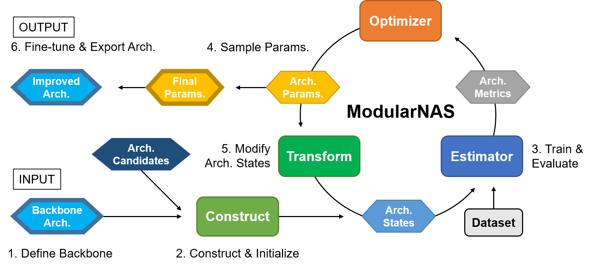

# ModularNAS

## 介绍

ModularNAS是一个神经架构搜索代码库，它把最先进的高效的NAS方法分解为模块化的、可重用的组件，如搜索算法、评估策略、架构搜索空间和候选项、网络转换等。同时统一了搜索过程中各组件之间的交互。
它还支持为自定义用例自动生成搜索空间，同时重用预定义的搜索策略，允许用户友好的NAS部署，而不需要额外的工作。

<center></center>

支持的NAS方法 (在VEGA上):

- DARTS [^fn1]
- ProxylessNAS [^fn2]
- Once for All [^fn3]

支持的搜索空间:

- MobileNetV2 [^fn4] blocks
- 自定义模型

## 原理

为了为各种NAS方法设计通用接口提供基础，我们提出了架构搜索过程的新公式，该公式将广受认可的NAS方法分解为基本组件的组合。强调架构状态的转换（例如，被评估网络的权重），通常以权重共享和网络变形的形式出现。

具体来说，我们将NAS过程涉及的变量分为三种基本类型:
- 架构参数α表示搜索空间中所有可能的架构的编码
- 架构状态V表示在架构更新和评估的搜索过程中产生的状态，例如网络权重和拓扑
- 度量R表示候选架构的估计性能分数

然后，我们将NAS过程的操作符分解为四个独立工作的组件:
- 搜索优化器Ω优化结构参数
- 状态优化器ω更新网络架构状态
- 状态评估器利用更新的状态评估架构度量
- 状态变换函数δ根据参数控制修改架构状态

架构搜索流程的统一表述总结如下图所示。

<center></center>

遵循统一表述，我们设计并实现了ModularNAS，并考虑了简单、模块化和可重用性。
具体来说，我们引入了一个新的编程范式来定义架构搜索空间，使搜索空间的自动生成和重用得以实现。
为了支持复杂的NAS方法，如网络形态，我们实现了与生成的搜索空间绑定并在搜索例程中自动调用的体系结构转换功能。

## 使用指南

### 在VEGA上运行ModularNAS

按照 [安装指南](../user/install.md) 安装VEGA框架及其依赖。

在 “vega/contrib/examples” 目录下，执行YAML配置文件指定的pipeline任务，命令如下：

	python3 run_example.py -p modnas <path_to_yaml>

我们在MobleNetV2架构搜索空间上提供了一些预定义的YAML配置：

- nas/modnas/mbv2.yml: 训练原MobileNetV2网络
- nas/modnas/ps.yml: 应用渐进式收缩（Progressive Shrinking）训练和进化搜索，如 Once for All [^fn3]
- nas/modnas/darts.yml: 应用 DARTS [^fn1] 搜索算法和超网络估计策略
- nas/modnas/pxl.yml: 应用 ProxylessNAS [^fn2] 搜索算法和超网络估计策略

### 搜索空间配置

ModularNAS搜索空间可以从基本网络模型（称为backbone）中自动和过程地生成，其中构造函数链指定了按顺序步骤自动生成搜索空间的行为。我们提供了各种搜索空间组件和构造函数，可用于在自定义模型上构建灵活的搜索空间。

下面是一个MobileNetV2搜索空间的YAML配置示例，定义了每个网络块（共21个）的残差卷积层的扩展比（expansion ratio）和卷积核大小，model部分定义了基本模型。construct部分定义了一个单一构造函数，该构造函数将生成一个搜索空间和包含所有候选操作的混合操作符的超网络。

```yaml
search_space:
  type: SearchSpace
  modules: ['custom']
  custom:
    type: ModNasArchSpace
    model:
      type: CIFAR_MobileNetV2_GPU
    construct:
      mixed_op:
        type: BinGate
        primitives:
          - MB3E3
          - MB3E6
          - MB5E3
          - MB5E6
          - MB7E3
          - MB7E6
```

支持的基础模型类型有 (位于 search_space.custom.model.type):

- ImageNet_MobileNetV2: ILSVRC2012数据集上的原MobileNetV2架构
- CIFAR_MobileNetV2: 用普通卷积代替一些下采样卷积
- ImageNet_MobileNetV2_GPU: 深度和宽度增加的MBV2架构
- CIFAR_MobileNetV2_GPU: MBV2架构，深度和宽度增加，删除了部分下采样

支持的混合运算符类型有 (位于 search_space.custom.construct.mixed_op.type):

- BinGate: 一种由01门控制的混合运算符，如在ProxylessNAS中
- BinGateUniform: BinGate的变体，在前向传递中，从均匀分布中采样候选算符
- WeightedSum: 返回由架构参数的softmax加权的候选算子输出的总和，如在DARTS中
- GumbelSum: 返回由参数的gumbel softmax加权的输出总和，如在SNAS中
- Index: 返回由架构参数（离散）选择的候选项的输出，如SPOS、CARS等

Supported candidate operator (primitive) types are (in search_space.custom.construct.mixed_op.primitives):

- MBxEy: 卷积核大小为x，膨胀比为y的Mobile Inverted Residual Convolution（例如MB3E6）
- NIL: 总是返回输入大小的零值张量的空操作
- IDT: 返回原始输入的等操作

支持的构造函数类型有 (位于 search_space.custom.construct):

- DefaultMixedOpConstructor: 将网络中的所有占位符模块转换为混合运算符（默认）
- DefaultOpConstructor: 将所有占位符模块转换为指定的运算符
- DefaultSlotArchDescConstructor: 将每个占位符从运算符名称列表中转换为实际模块
- DefaultRecursiveArchDescConstructor: 按照运算符描述列表的递归顺序将每个占位符转换为实际模块

### 搜索算法配置

架构搜索例程需要运行一个搜索算法来预测搜索空间中的下一个候选架构，该算法在ModuleNAS中实现为Optimizer组件。我们提供了支持高效架构搜索的最先进的搜索算法的实现。

下面是使用ProxylessNAS-G作为搜索算法的YAML中Optimizer配置的一个示例。可以提供一个可选的“args”部分来配置优化器参数，如学习速率和权重衰减。

```yaml
search_algorithm:
  type: ModNasAlgorithm
  optim:
    type: BinaryGateOptim
    # args:
```

支持的优化器类型有 (位于 search_algorithm.type.optim.type):

- BinaryGateOptim: 基于ProxylessNAS-G梯度搜索算法
- DARTSOptim: 基于二阶逼近的DARTS梯度搜索算法
- REINFORCEOptim: REINFORCE策略梯度搜索算法，如ProxylessNAS-R中的
- DirectGradOptim: 架构参数的直通梯度下降
- DirectGradOptimBiLevel: 验证数据集上的直通梯度下降
- EvolutionOptim: 基本的进化搜索
- RegularizedEvolutionOptim: 正则化（老化）进化搜索算法，如[^fn5]
- RandomSearchOptim: 离散搜索空间中的随机搜索
- GridSearchOptim: 离散搜索空间中的网格搜索

### 评估策略配置

对搜索算法（Optimizer）采样的候选体系结构进行评估，以获得其性能和效率指标，如准确性、延迟和FLOPS。存在多种评估技术，以牺牲保真性为代价，大大加快了网络性能的评估过程。我们提供通用的评估策略在有效的NAS方法的实现作为估计器（Estimator）组件在模块化NAS。

下面是YAML中Estimator配置的一个示例，它指定了一个名为“search”的Estimator组件，它把网络看作一个超网，并在每个epoch交替更新网络权重和架构参数。

```yaml
trainer:
  type: Trainer
  callbacks: ModNasTrainerCallback
  modnas:
    estim:
      search:
        type: SuperNetEstimator
        epochs: 1
```

此外，多个估计器可以链接在一起，以执行复杂的操作，例如在训练架构参数之前预热启动网络权重。

```yaml
trainer:
  type: Trainer
  callbacks: ModNasTrainerCallback
  modnas:
    estim:
      warmup:
      	type: DefaultEstimator
      	epochs: 20
      search:
        type: SuperNetEstimator
        epochs: 100
```

支持的估计器类型有 (位于 trainer.modnas.estim.*.type):

- DefaultEstimator: 仅训练网络权重
- SuperNetEstimator: 交替训练网络权重和更新架构参数
- SubNetEstimator: 分别对每个候选架构进行培训和评估
- ProgressiveShrinkingEstimator: 使用渐进收缩（PS）训练网络，如 Once for All [^fn1]

出于兼容性考虑，需要在SearchPipeStep的Trainer配置中设置如下内容：

```yaml
trainer:
  valid_interval: 0
  lazy_built: True
  epochs: # >= total estimator training epochs
```

### 输出说明

ModularNAS例程生成的输出位于“{local_worker_path}/exp/default/”，其中“{local_worker_path}”为VEGA工作器输出目录的路径。通常为“tasks/\<name\>/workers/nas/0/”。输出文件夹可能包含以下文件：

- logs: 日志输出
- writers: SummaryWriter输出
- outputs:
  - outputs/arch\_\<name\>\_best.yaml: 在名为\<name\>的估计器中找到的最佳网络架构描述

默认情况下，通过连接每个转换模块的架构描述来输出架构描述，例如每个混合算子的最佳候选。您可以使用不同的导出程序（Exporter）指定替代导出行为。支持的类型有 (位于 trainer.modnas.export.*.type):

- DefaultSlotTraversalExporter: 通过遍历网络中的每个占位符导出架构描述
- DefaultRecursiveExporter: 通过递归访问网络中的每个模块导出架构描述
- DefaultParamsExporter: 导出架构参数的键值对

### 网络重训

在搜索过程中找到的最佳架构可以在紧跟的TrainPipeStep中完全训练，最佳架构描述作为参数（在search_space.custom.arch_desc中）传递，以构造目标模型。要指定从描述构建模型时使用的构造函数，请在搜索空间配置中指定“desc_construct”部分，如下所示：

```yaml
search_space:
  type: SearchSpace
  modules: [custom]
  custom:
    type: ModNasArchSpace
    model:
      ...
    construct:
      ... # search space constructor
    desc_construct:
      arch_desc:
        type: # arch. desc. constructor
```

构造例程将在搜索阶段使用基模型上的搜索空间构造函数，在完全训练阶段使用架构描述构造函数。

## 开发指南

### 注册组件

ModularNAS通过在VEGA注册表中查找其名称来实例化体系结构搜索组件。可以使用多个API来注册新组件。例如，要将自己的模型注册为生成搜索空间的新基本模型，只需按如下方式使用“register”装饰器。

```python
from vega.contrib.vega.algorithms.nas.modnas.registry.search_space import register

@register
class YourModelClass(nn.Module):
    ...

```

这将YourModelClass以相同的名称添加到注册表中。或者，可以使用“register”作为函数来指定注册表中的名称。

```python
register(YourModelClass, 'your_model_name')
```

要在注册表中实例化该组件，请使用“build”函数，如下所示：

```python
from vega.contrib.vega.algorithms.nas.modnas.registry.search_space import build

your_model = build('YourModelClass', *args, **kwargs)
```

或者，先使用'get_builder'函数获取构造函数：

```python
from vega.contrib.vega.algorithms.nas.modnas.registry.search_space import get_builder

your_model = get_builder('YourModelClass')(*args, **kwargs)
```

支持的注册表路径为：

- search_space: 搜索空间组件：基模型、混合算子、候选算子等。
- construct: 构造器组件
- optim: 优化器组件
- estim: 估计器组件

### 自定义搜索空间

ModularNAS支持在几行代码中自动生成搜索空间。要使用此功能，只需用名为Slot的占位符模块替换要搜索的网络层或运算符。

以卷积神经网络为例。要搜索运算符的最佳选择，只需将以下定义卷积层的语句：

```python
self.conv = Conv2d(in_channels=C_in, out_channels=C_out, stride=stride)
```

用Slot模块的实例化替换：

```python
self.conv = Slot(_chn_in=C_in, _chn_out=C_out, _stride=stride)
```

现在我们定义了一个搜索空间模板，其中卷积算子可以转换为各种结构，包括混合算子、弹性模块和嵌套网络层。若使用混合运算符，则在YAML config文件中定义搜索空间段如下：

```yaml
search_space:
  type: SearchSpace
  modules: ['custom']
  custom:
    type: ModNasArchSpace
    model:
      type: # your model class
    construct:
      mixed_op:
        type: DefaultMixedOpConstructor
        args:
          # mixed operator and primitives
```

现在，我们在基础模型之上定义了一个超网，其中原来的卷积算子被指定的混合算子和原语替换。然后，可以通过将搜索空间与选定的优化器和估计器匹配来设置搜索例程。

## 已知问题

- 目前， ModularNAS例程在单独的线程中运行，并监听Vega中的条件变量，这可能导致死锁。

## 参考文献

[^fn1]: Liu, H., Simonyan, K., and Yang, Y. Darts: Differentiable architecture search. ArXiv, abs/1806.09055, 2019b.

[^fn2]: Cai, H., Zhu, L., and Han, S. Proxylessnas: Direct neural architecture search on target task and hardware. ArXiv, abs/1812.00332, 2019.

[^fn3]: Cai, H., Gan, C., and Han, S. Once for all: Train one network and specialize it for efficient deployment. ArXiv, abs/1908.09791, 2020.

[^fn4]: Sandler, M., Howard, A. G., Zhu, M., Zhmoginov, A., and Chen, L.-C. Mobilenetv2: Inverted residuals and linear bottlenecks. 2018 IEEE/CVF Conference on Computer Vision and Pattern Recognition, pp. 4510–4520, 2018.

[^fn5]: Real, E., Aggarwal, A., Huang, Y., and Le, Q. V. Regularized evolution for image classifier architecture search. In AAAI, 2018.
