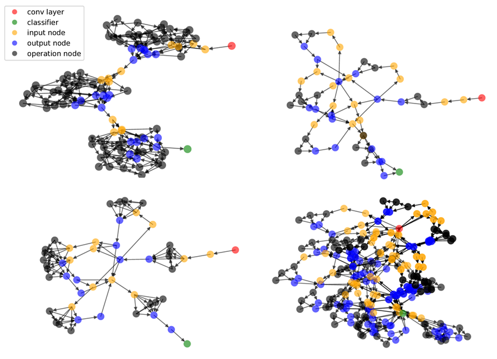

# NAGO

## 1. 算法介绍

[Neural Architecture Generator Optimization](https://arxiv.org/abs/2004.01395) (NAGO) 首次提出了搜索最优的神经网络结构生成分布（architecture generator）而不仅仅是单个神经网络(single architecture) 的概念，并针对这个概念提出了一个全新的，多阶层的，基于图的搜索空间。该搜索空间不但能生成非常多样化的网络结构，而且只由几个超参来定义。这极大减少了结构搜索的维度，使得我们能高效地使用贝叶斯优化作为搜索策略。
与此同时，因为我们拓广了搜索空间（包含众多性能和存储需求差异巨大的有效网络结构）， 这使得多目标学习在我们的场景下更有意义。

## 2. 算法原理

### 2.1 搜索空间设计


我们的搜索空间是一个三阶层的图结构：结构的最顶层是一张由中层模块组成的图，每个中层模块本身是一张底层模块组成的图， 而每个底层模块也是一张由基础运算单位（例如`conv3x3`, `conv5x5`等等）构成的图。这三个阶层的图结构分别由三个随机图生成器来独立生成， 且每个生成器都由一组对应的超参来定义：`X_{top}, X_{mid}, X_{bottom}` 。在生成器的选择上，我们使用Watts-Strogatz (WS) 图模型作为顶层和底层图的生成器，它们对应的超参是 `X_{top}=[N_{t}, K_{t}, P_{t}]` 和 `X_{bottom}=[N_{b}, K_{b}, P_{b}]` ；我们选择Erdos-Renyi (ER) 图模型作为中层图的生成器从而允许单节点图的生成，它对应的超参是 `X_{mid}=[N_{m}, P_{m}]` 。

通过改变随机图生成器的超参，我们可以自由控制每层图的连接特性，从而生成非常多样化的神经网络结构。举个例子，如果顶层图是20个节点串联的排布且中层图是单节点，我们就还原了DARTS的搜索空间设计；如果我们把顶层图，中层图和底层图分别固定为3个节点，单个节点和32个节点，我们就可以还原 [（Xie et al., 2019）](https://arxiv.org/abs/1904.01569)的搜索空间。

### 2.2 生成的神经网络样本



### 2.3 搜索策略

我们提出的多阶层，基于图的搜索空间让我们能通过调整少量的几个超参来生成非常多样化的网络结构。这使得很多高效的贝叶斯优化方法能直接适用于神经网络结构搜索的任务。
在VEGA的代码中，我们采用了一种多保真度的贝叶斯优化方式 [BOHB](https://arxiv.org/abs/1807.01774)： BOHB 会基于低保真度的评估来快速筛除相对较差的超参组合，所以在同等时间内，BOHB评估的超参数量会远远高于普通贝叶斯优化的方法。更多关于BOHB的技术细节请参考 `hpo.md` 。

## 4. 使用知道

### 4.1 搜索空间设置

在 `nago.yaml` 文件中，NAGO的搜索空间可以用以下的方式来设定：

```yaml
search_space:
    type: SearchSpace
    hyperparameters:
        -   key: network.custom.G1_nodes
            type: INT
            range: [3, 10]
        -   key: network.custom.G1_K
            type: INT
            range: [2, 5]
        -   key: network.custom.G1_P
            type: FLOAT
            range: [0.1, 1.0]
        -   key: network.custom.G2_nodes
            type: INT
            range: [3, 10]
        -   key: network.custom.G2_P
            type: FLOAT
            range: [0.1, 1.0]
        -   key: network.custom.G3_nodes
            type: INT
            range: [3, 10]
        -   key: network.custom.G3_K
            type: INT
            range: [2, 5]
        -   key: network.custom.G3_P
            type: FLOAT
            range: [0.1, 1.0]
```

注意虽然NAGO使用了VEGA中的NAS pipeline, 我们设定其搜索空间时，遵从的却是HPO pipeline的模板。因为我们使用了HPO中的BOHB方法来执行搜索。
根据 `nago.yml` 文件中的设置，我们通过 `zeus/networks/pytorch/customs/nago.py` 中的代码来生成有效的神经网络结构（即可以用PyTorch训练的神经网络模型）。

### 4.2 搜索策略设置

NAGO的搜索空间适用于任何贝叶斯优化算法。在VEGA中我们采用了BOHB, 所以我们需要在 `nago.yml` 文件中也设置BOHB算法的基本参数。
例如，下面的设置会跑50个搜索循环的BOHB，并用最少30 epochs和最多120 epochs来训练和评估所生成的神经网络结构。

```yaml
search_algorithm:
    type: BohbHpo
    policy:
        total_epochs: -1
        repeat_times: 50
        num_samples: 350
        max_epochs: 120
        min_epochs: 30
        eta: 2
```

### 4.3 在VEGA中运行NAGO

- 按照[说明](../user/install.md) 安装 vega
- 按照以上描述通过 `nago.yml` 定义NAGO的运行设置，并把任务数据集放到 `nago.yml` 中 `data_path` 指定的位置
- 运行命令 `vega ./nas/nago/nago.yml`

### 5. 算法输出

以下两个输出文件会在指定的输出目录中生成（默认输出目录是 `./example/tasks/<task id>/output/nas/` ):

- `output.csv` 文件包含了BOHB推荐的最优网络结构生成器的超参数值。
- `reports.csv` 文件包含了BOHB搜索过程中评估过的所有超参组合的数据。
