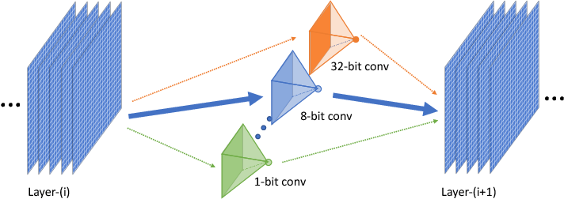

# QuantEA

## 1. 算法介绍

QuantEA（Quantization based on Evolutionary Algorithm）是一种自动混合比特量化算法，使用进化策略对CNN网络结构每层量化位宽进行搜索。以自动量化压缩ResNet-20为例，量化的搜索空间为每层卷积核参数的量化位宽和激活值的量化位宽（如2bit/4bit/8bit等）。维护一个包含N个个体的种群P，每个个体对应一个压缩的网络模型。通过交叉变异产生一个同样大小N的种群P’，每个压缩的网络模型通过进行training/valid，在验证集的Accuracy、FLOPs、参数量等用户指定的指标，作为优化目标，来对个体进行排序选择，更新维持的种群P。



## 2. 算法原理

### 2.1 搜索空间

搜索空间为神经网络每层参数（Weights）的量化位宽和激活值（Activations）的量化位宽（如2bit/4bit/8bit等）。以ResNet-20为例，一般第一层和最后一层不做量化，对中间18层的Weights/Activations量化位宽进行搜索，设置每层的搜索候选为[2bit,4bit,8bit]，那么总共的搜索空间有$`3^{(18+18)}=1.5\times 10^{17}`$这么大。

### 2.2 搜索算法

我们使用NSGA-III多目标优化进化算法进行pareto front的搜索：

1. 搜索过程：
   1.1. 根据【搜索空间】，通过交叉、变异等【进化操作】从种群P生成N个压缩模型的编码；
2. 评估过程：
   2.1. 根据【进化操作】生成的N个编码，完成压缩模型的构建；
   2.2 执行【评估过程】，产生用户定义的所有评估结果，包括Accuracy、FLOPs、参数量等；
3. 优化过程：
   3.1. 调用【进化算法】，对种群P进行更新；

重复【搜索过程】->【评估过程】->【优化过程】过程，完成整个进化自动量化位宽搜索流程，搜出Pareto前沿。搜索完量化模型之后，我们会对Pareto前沿的量化模型进行训练，得到量化模型的最终表现。NSGA-III算法详情参考原论文 [1]。

```text
[1] Deb, Kalyanmoy, and Himanshu Jain. "An evolutionary many-objective optimization algorithm using reference-point-based nondominated sorting approach, part I: solving problems with box constraints." *IEEE Transactions on Evolutionary Computation* 18.4 (2013): 577-601.
```

### 2.3 优点

1. 可以将fp32的模型量化为low-bit，减少计算和存储开销；
2. 进化算法搜索每层的量化比特位宽，搜出来的模型比所有层统一量化为8bit（baseline-w8a8）或4bit（baseline-w4a4）都有优势，更少的计算量，更高的分类正确率。
3. NSGA-III算法可以搜索出pareto前沿，一次性产生多个不同约束下的最优模型。

## 3. 适用场景

本方法用于对fp32模型进行量化压缩，可以用于各种场景，目前给的example是图像分类场景。
本方法及对数据没有要求，目前给的example是CIFAR-10图像分类数据集。

## 4. 使用指导

### 4.1 搜索空间配置

搜索空间为给定神经网络每个卷积层中：

权重Weights和激活值Activation的量化位宽（可通过`examples/compression/quant_ea/quant_ea.yml`中`bit_candidates`进行配置，如[4,8]表示搜索空间为4/8bit）


目前的代码提供了ResNet系列作为基础神经网络，如果需要更换为其他网络，可参考``vega/networks/quant.py``将你自己的网络的`nn.Conv2d`更换为我们的量化卷积层`QuantConv`。

### 4.2 dataset配置

QuantEA的数据可以是标准的CIFAR-10数据集，也可以是自定义的数据集。若要使用用户自定义格式的数据集，则需要实现符合Vega要求的数据集类，具体方法可参考开发手册。

CIFAR-10数据集集配置信息如下：


### 4.3 运行环境配置

在配置文件中进行参数配置，包括搜索量化模型、训练量化模型2个过程，对应配置文件``examples/compression/quant_ea/quant_ea.yml``中的`nas`和`fully_train`。

在examples下执行命令：

`vega ./compression/quant_ea/quant_ea.yml`

nas和fully_train两个过程会依次进行，搜索过程会搜出Pareto前沿，然后训练过程会把前沿的模型训到底，得到最终的表现。

### 5. 算法输出

输出文件：

- 搜索到的帕雷托前沿的模型经充分训练后得到的模型及结果
- `reports.csv`包含了搜索过程中所有模型的encoding/flops/parameters/accuracy；
- `output.csv`包含了搜索出来的pareto front的信息。
