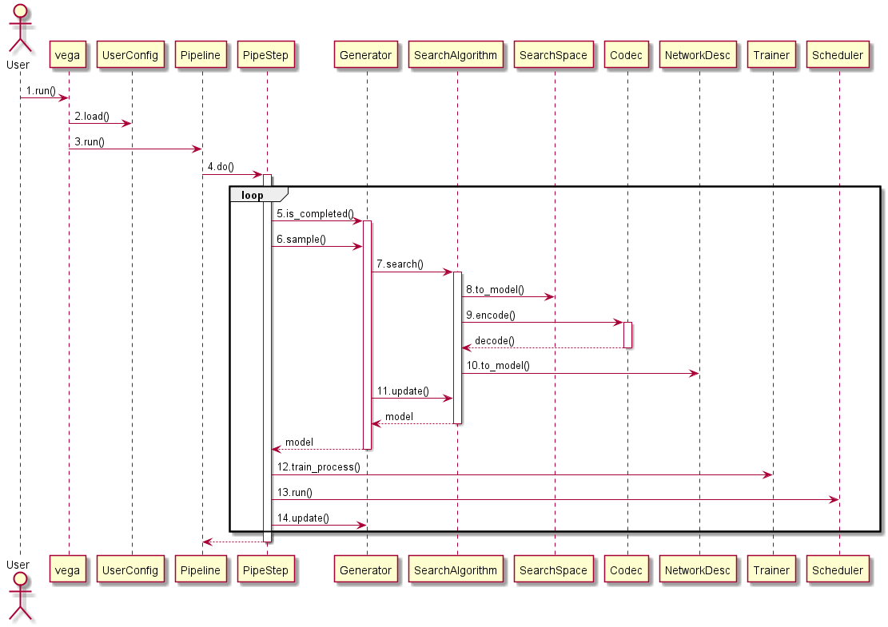

# 开发参考

## 1. Vega简介

Vega的重点特性是网络架构搜索和超参优化，在网络架构搜索流程中，搜索空间`Search Space`、搜索算法`Search Algorithm`是核心部分，并通过`Generator`来控制搜索的采样、更新和结束等流程步骤。

搜索空间和搜索算法的类图如下所示：


搜索空间和搜索算法的流程图如下所示：



以下就分别介绍下面几个部分：

* 搜索空间
* 搜索算法
* 完整的NAS搜索流程
* `Configuration`
* `Pipeline`
* `Trainer 和 fully train`

## 2. 搜索空间

### 2.1 Networks和NetworksFactory

Vega NAS的搜索空间包含了一系列预定义的网络类型，这些网络的组合或者每个网络的构造参数均可作为NAS的搜索空间。

在`vega/search_space/networks`下面定义了丰富的网络类型，并按照功能分成`backbone`、`head`、`RPN`、`blocks`、`super_network`等等，其中`backbone`指的是分类或者检测等网络中的骨干部分，`head`指的是分类或者检测等网络中输出头部分，`blocks`是一些基本的操作或者是由基本操作构成的一些常用的模块，`super_network`是`Parameter Sharing`里常用的超级网络等。还有不属于以上定义的自定义网络`customs`。

* search_space
  * netowrks
    * backbones
    * blocks
    * heads
    * rpn
    * super_network
    * customs

Vega的预定义和新增网络初始化参数均只接受一个参数，该参数的格式是`dict`，它是对这个网络的一个完整描述，在初始化函数里，将这些描述解析并生成网络模型。对于Vega来说，一个网络的`Search Space`就是这些描述的取值范围。

定义网络类后，将这些网络按照各自的类型注册到`NetworkFactory`，以`ResNet`的网络注册为例，代码如下：

```python
@NetworkFactory.register(NetTypes.BACKBONE)
class ResNet(Network):
    pass
```

如上代码所示，在`ResNet`类定义前面增加一个`NetworkFactory`的注册语句，因为`ResNet`属于`backbone`的类型，所以将它注册为`NetTypes.BACKBONE`的类型。

### 2.2 配置文件

在定义好网络类和注册之后，开发者需要将网络类构造描述详细地写在配置文件里，并给出某些参数的可选范围，如果某些参数不好通过配置文件给出搜索范围，可以先不写，但是在搜索出来的网络描述里一定要包括完整的参数。以`PruneResNet`的配置文件为例：

```yaml
search_space:
    type: SearchSpace
    modules: ['backbone']
    backbone:
        type: 'PruneResNet'
        base_chn: [16,16,16,32,32,32,64,64,64]
        base_chn_node: [16,16,32,64]
        num_classes: 10
```

这里的配置文件并没有包括所有的参数，搜索算法还需要对这些参数进行计算和解析，得到另外的几个参数后，才能一起生成`PruneResNet`的描述，作为`PruneResNet`的构造参数，具体请参考`vega/algorithms/compression/prune_ea`的示例。

### 2.3 SearchSpace类和NetworkDesc类

`SearchSpace`类初始化时，加载搜索空间配置文件为`search_space`属性，如下：

```python
class SearchSpace(object):
    def __init__(self):
        self.search_space = self.cfg
```

搜索空间还有一个重要的概念是网络描述`NetworkDesc`，网络描述是搜索算法从`SearchSpace`里采样出来的结果，它是`Search Space`中的一种可能性子集。网络描述类里只有一个属性，就是dict类型的网络描述（可以是一个网络或者多个网络）。网络描述类只一个通用的`to_model()`的接口，负责分析网络描述并通过`NetworFactory`自动解析成`Networks`里具体的网络对象。

```python
class NetworkDesc(object):
    def __init__(self, desc):
        self.desc = Config(desc)

    def to_model(self):
        pass
```

总的来说，Vega提供预定义（支持开发者新增）的一系列网络模型`Networks`，并注册到`NetworkFactory`，开发者需要将网络模型构造参数的搜索空间写在配置文件中，通过算法去采样和生成网络描述`NetworkDesc`，`NetworkDesc`自动解析出相应的网络模型。

## 3. 搜索算法

Vega的SDK提供一些默认的搜索算法，比如随机搜索、基本进化算法等，开发者可根据需要自行扩充搜索算法。这些算法都需要注册到统一的`ClassFactory`里，标签为`ClassType.SEARCH_ALGORITHM`。

搜索算法的初始化有两个参数，一个是配置文件中的`search_algorithm`部分， 还有一个是`SearchSpace`类的对象。

搜索算法主要完成的功能有：

* 从搜索空间中搜索出一个网络描述`net_desc`
* 从训练结果中去更新搜索算法
* 判断搜索过程是否完成

其中，最重要的是第一个功能，它负责在`SearchSpace`对象中搜索出一个子集，作为网络描述。

```python
class SearchAlgorithm(TaskUtils):

    def __init__(self, search_space=None, **kwargs):
        super(SearchAlgorithm, self).__init__(self.cfg)

    def search(self):
        raise NotImplementedError

    def update(self, local_worker_path):
        raise NotImplementedError

    @property
    def is_completed(self):
        return False
```

在一些算法中（比如`EA`），可能还会涉及到搜索空间的编码问题，所以还要在搜索算法里实现一个编解码器`Codec`，编解码器主要完成两个功能，一个是将网络描述编码化，还有一个是将编码解码成网络描述。

```python
class Codec(object):
    def encode(self, desc):
        raise NotImplementedError

    def decode(self, code):
        raise NotImplementedError
```

搜索算法的类别和参数需要写在配置文件中，以`PruneEA`为示例：

```yaml
search_algorithm:
    type: PruneEA
    length: 464
    num_generation: 31
    num_individual: 4
    metric_x: flops
    metric_y: acc
    random_models: 32
    codec: PruneCodec
```

配置文件中，需要定义搜索算法的类型，以及该类型搜索算法的参数。

## 4. NAS搜索流程

NAS的搜索流程主要包括`Generator`和`Trainer`两个部分，其中`Generator`负责通过搜索算法在搜索空间中采样出一个网络模型，将网络模型初始化成`Trainer`后，`Trainer`被分发到节点上运行。

NAS的搜索流程是在`NasPipeStep`中完成的，`NasPipeStep`的主要功能是在`do()`函数中完成的，实现代码如下：

```python
def do(self):
        """Do the main task in this pipe step."""
        logger.info("NasPipeStep started...")
        while not self.generator.is_completed:
            id, model = self.generator.sample()
            cls_trainer = ClassFactory.get_cls('trainer')
            trainer = cls_trainer(model, id)
            self.master.run(trainer)
            finished_trainer_info = self.master.pop_finished_worker()
            self.update_generator(self.generator, finished_trainer_info)
        self.master.join()
        finished_trainer_info = self.master.pop_all_finished_train_worker()
        self.update_generator(self.generator, finished_trainer_info)
```

在每一次循环中，`Generator`首先判断搜索是否停止，如果停止了就结束搜索，更新`Generator`并返回。

如果未停止，`Generator`通过`sample()`函数生成一个网络模型和`id`，`ClassFactory`根据配置文件定位到具体的`Trainer`类，再通过网络模型和`Trainer`配置参数初始化出对应的`Trainer`对象。`Master`负责将`trainer`分发到空闲的节点上运行，并得到已完成节点的`trainer`结果，再去更新`Generator`，如是循环。

### 4.1 Generator

Generator里将定义Search Space和Search Algorithm的对象，后面在每一次循环中，Search Algorithm从Search Space中采样出一个model，并将model初始化成NAS的Trainer。

这是一个标准的过程，如果没有特殊的处理步骤，无需额外添加或者重新实现。Generator的实现代码如下：

```python
class Generator(object):
    _subclasses = {}

    def __init__(self):
        self.search_space = SearchSpace()
        self.search_alg = SearchAlgorithm(self.search_space)

    @property
    def is_completed(self):
        return self.search_alg.is_completed

    def sample(self):
        id, net_desc = self.search_alg.search()
        model = net_desc.to_model()
        return id, model

    def update(self, worker_path):
        self.search_alg.update(worker_path)
        return
```

初始化时，首先通过配置文件中search_space部分生成搜索空间的对象，将搜索空间作为参数初始化搜索算法的对象。

代码中的sample接口即是NAS中每一次采样，首先调用搜索算法search出一个网络描述，再通过网络描述生成网络模型。

此外，Generator还具有判断迭代搜索是否停止以及更新搜索算法等功能。

### 4.2 Trainer

在NasPipeStep里，Generator生成出网络模型后，会进一步初始化出一个Trainer，Trainer是一个完整的Fully Train的过程，其主要接口是train_process，以及一些优化器、学习率策略和损失函数等标准接口。Vega提供了标准的Trainer接口和训练流程，开发者只需要通过修改配置文件来控制训练参数和训练过程。也支持用户自定义一些尚未提供的功能。

Trainer的配置形式如下所示：

```yaml
trainer:
    type: Trainer
    optim:
        type: SGD
        lr: 0.1
        momentum: 0.9
        weight_decay: !!float 1e-4
    lr_scheduler:
        type: StepLR
        step_size: 20
        gamma: 0.5
    loss:
        type: CrossEntropyLoss
    metric:
        type: accuracy
    report_freq: 50
    epochs: 50
```

Trainer的配置参数需将优化器、学习率策略和损失函数的名称和参数写入对应位置，标准的Trainer提供解析这些对象的初始化接口。

标准的Trainer的训练过程实现在train_process接口里，具体实现如下：

```python
    def train_process(self):
        """Whole train process of the TrainWorker specified in config.

        After training, the model and validation results are saved to local_worker_path and s3_path.
        """
        self._init_estimator()
        self._init_dataloader()
        logging_hook = []
        if self.horovod:
            logging_hook += [hvd.BroadcastGlobalVariablesHook(0)]
        train_steps = self.train_data.data_len
        valid_steps = self.valid_data.data_len
        if self.horovod:
            train_steps = train_steps // hvd.size()
            valid_steps = valid_steps // hvd.size()
        start_step = est._load_global_step_from_checkpoint_dir(self.cfg.model_dir)
        for i in range(self.cfg.epochs):
            logging.info('train epoch [{0}/{1}]'.format(i, self.cfg.epochs))
            current_max_step = start_step + train_steps
            start_step = current_max_step
            self.estimator.train(input_fn=self.train_data.input_fn,
                                 max_steps=current_max_step,
                                 hooks=logging_hook)
            eval_results = self.estimator.evaluate(input_fn=self.valid_data.input_fn, steps=valid_steps)
            logging.info(eval_results)
        self.save_backup(eval_results)
```

为了方便开发者使用，我们讲trainer中需要使用的部分能力进行了封装并提供对于的扩展接口

#### Optimizer

默认使用pytroch库上的`torch.optim`，采用配置方式直接使用，`type`表示使用的方法，其他键值为方法中的入参和入参的值

```yaml
optim:
        type: SGD
        lr: 0.1
        momentum: 0.9
        weight_decay: !!float 1e-4
```

#### Loss

默认可以直接使用`torch.nn`下的所有loss函数，采用配置方式使用，`type`表示使用的方法，其他键值为方法中的入参和入参的值

```yaml
loss:
    type: CrossEntropyLoss
```

也可以自定义Loss函数并在配置中指定:

- 使用`@ClassFactory.register(ClassType.LOSS)`进行注册

```python

@ClassFactory.register(ClassType.LOSS)
class CustomCrossEntropyLoss(Network):
    """Cross Entropy Loss."""

    def __init__(self, desc):
        super(CustomCrossEntropyLoss, self).__init__()
        	pass

    def forward(self, **kwargs):
        pass

```

- 在配置文件中引用CustomCrossEntropyLoss

```yaml
loss:
        type: CustomCrossEntropyLoss
        desc: ~
```

#### LrScheduler

​	默认可以直接使用`torch.optim.lr_scheduler`下的所有lr_scheduler函数，采用配置方式使用，`type`表示使用的方法，其他键值为方法中的入参和入参的值

```yaml
lr_scheduler:
        type: StepLR
        step_size: 20
        gamma: 0.5
```

自定义一个LrScheduler

- 使用`@ClassFactory.register(ClassType.LOSS)`进行注册，并在配置文件中引用
- 需要实现step接口，入参为epoch

```python
@ClassFactory.register(ClassType.LR_SCHEDULER)
class WarmupScheduler(_LRScheduler):
    def step(self, epoch=None):
         pass
```

#### Metrics

常用的metrics已预置在vega中，可直接在配置文件中配置使用，同时支持处理多个metrics进行打印分析。当有多个metrics的时候，会自动以第一个metric函数计算loss。

```yaml
metric:
   type: accuracy
```

自定义一个metric

- 使用`@ClassFactory.register(ClassType.METRIC)`进行注册
- 继承`vega.core.metrics.metrics_base.MetricBase`
- 指定`__metric_name__`，供记录打印metrics使用
- 实现`__call__`、`summay`、`reset`方法，call是在每轮step的时候调用，summay是每轮epoch结束后调用

```python
@ClassFactory.register(ClassType.METRIC, alias='accuracy')
class Accuracy(MetricBase):
    """Calculate classification accuracy between output and target."""

    __metric_name__ = 'accuracy'

    def __init__(self, topk=(1,)):
        """Init Accuracy metric."""
        self.topk = topk
        self.sum = [0.] * len(topk)
        self.data_num = 0
        self.pfm = [0.] * len(topk)

    def __call__(self, output, target, *args, **kwargs):
        """Perform top k accuracy.

        :param output: output of classification network
        :param target: ground truth from dataset
        :return: pfm
        """
        if isinstance(output, tuple):
            output = output[0]
        res = accuracy(output, target, self.topk)
        n = output.size(0)
        self.data_num += n
        self.sum = [self.sum[index] + item.item() * n for index, item in enumerate(res)]
        self.pfm = [item / self.data_num for item in self.sum]
        return res

    def reset(self):
        """Reset states for new evaluation after each epoch."""
        self.sum = [0.] * len(self.topk)
        self.data_num = 0
        self.pfm = [0.] * len(self.topk)

    def summary(self):
        """Summary all cached records, here is the last pfm record."""
        return self.pfm
```

另外，我们支持多个metrics的统一管理，使用Metrics类管理trainer各种不同类型的metrics，统一各个metrics的初始化、调用的接口和获取结果的方式。

- 根绝配置文件中metric部分的内容初始化`Metrics`，在每次valid的时候初始化一次
- 根据网络的输出数据和数据集标签数据，调用`__call__`，计算每次数据的metric和历史平均值
- `results`返回metric的历史综合结果

```python
class Metrics(object):
    """Metrics class of all metrics defined in cfg.

    :param metric_cfg: metric part of config
    :type metric_cfg: dict or Config
    """

    __supported_call__ = ['accuracy', 'DetMetric', 'IoUMetric', 'SRMetric']

    def __init__(self, metric_cfg):
        """Init Metrics."""
        metric_config = deepcopy(metric_cfg)
        self.mdict = {}
        if not isinstance(metric_config, list):
            metric_config = [metric_config]
        for metric_item in metric_config:
            metric_name = metric_item.pop('type')
            if ClassFactory.is_exists(ClassType.METRIC, metric_name):
                metric_class = ClassFactory.get_cls(ClassType.METRIC, metric_name)
            else:
                metric_class = getattr(importlib.import_module('vega.core.metrics'), metric_name)
            if isfunction(metric_class):
                metric_class = partial(metric_class, **metric_item)
            else:
                metric_class = metric_class(**metric_item)
            self.mdict[metric_name] = metric_class
        self.mdict = Config(self.mdict)

    def __call__(self, output=None, target=None, *args, **kwargs):
        pfms = []
        for key in self.mdict:
            metric = self.mdict[key]
            if key in self.__supported_call__:
                pfms.append(metric(output, target, *args, **kwargs))
        if len(pfms) == 1:
            return pfms[0]
        else:
            return pfms

    @property
    def results(self):
        results = [self.mdict[name].summary() for name in self.mdict if name in self.__supported_call__]
        if len(results) == 1:
            return deepcopy(results[0])
        else:
            return deepcopy(results)
```

#### 自定义Trainer

当我们提供的通用trainer的能力不能够满足当前要求，可以使用如下方法自定义自己的trainer

- 使用`@ClassFactory.register(ClassType.TRAINER)`进行注册
- 继承`vega.core.trainer.trainer.Trainer`基类
- 覆盖`train_process`方法

```python
from vega.core.trainer.trainer import Trainer
from vega.core.common.class_factory import ClassFactory, ClassType

@ClassFactory.register(ClassType.TRAINER)
class BackboneNasTrainer(Trainer):

    def __init__(self, model, id):
        """Init BackboneNasTrainer."""
        super(BackboneNasTrainer, self).__init__(model, id)
        self.best_prec = 0

    def train_process(self):
        pass 
```

> 备注： 我们可以覆盖更细粒度的方法，如tain和valid，这样可以使用trainer基类提供的部分能力

## 5. Configuration

Vega Configuration采用注册机制，可以根据class type动态的映射配置文件中的配置到对应的实例上，从而使得开发者和用户能够直接使用`cfg`属性，无感知配置文件的加载和解析的过程。

我们首先从如何使用配置开始，来逐步说明配置的机制：

* **Step1: 用户使用`rega.run()`加载用户定义的配置文件，并运行vega程序**

    ```python
    vega.run('config.yml')
    ```

* **Step2: `config.yml`中采用如下定义**

    ```yaml
    # 公共配置，包含task和worker相关配置信息
    general:
        task:
            key: value
        worker:
            key: value
    # 指定pipestep的执行顺序
    pipeline: [nas1, fullytrain1]
    # pipestep名称
    nas1:
        # 采用何种PipeStep
        pipe_step:
            type: NasPipeStep
        # 采用何种SearchAlgrithm算法，其配置有哪些
        search_algorithm:
            type: BackboneNas
            key: value
        # SearchSpace的配置
        search_space:
            type: SearchSpace
            key: value
        # Model的配置
        mode:
            model_desc: value
        # Trainer的配置
        trainer:
            type: Trainer
        # Dataset的配置
        dataset:
            type: Cifar10
    ```

* **Step3:  使用`ClassFactory`注册需要使用配置的类**

    `ClassFactory`提供给了多种`ClassType`可供开发者选择，分别对应了`config`文件中的第二层节点

    ```python

    class ClassType(object):
        """Const class saved defined class type."""

        TRAINER = 'trainer'
        METRIC = 'trainer.metric'
        OPTIM = 'trainer.optim'
        LR_SCHEDULER = 'trainer.lr_scheduler'
        LOSS = 'trainer.loss'
        EVALUATOR = 'evaluator'
        GPU_EVALUATOR = 'evaluator.gpu_evaluator'
        HAVA_D_EVALUATOR = 'evaluator.hava_d_evaluator'
        DAVINCI_MOBILE_EVALUATOR = 'evaluator.davinci_mobile_evaluator'
        SEARCH_ALGORITHM = 'search_algorithm'
        SEARCH_SPACE = 'search_space'
        PIPE_STEP = 'pipe_step'
        GENERAL = 'general'
        HPO = 'hpo'
        DATASET = 'dataset'
        TRANSFORM = 'dataset.transforms'
        CALLBACK = 'trainer.callback'
    ```

    算法开发者根据自己的需要选择对应的`ClassType`，并使用`@ClassFactory.register(class type)`将`class`注册到相应的类中。如下样例，我们将`BackboneNas`注册到`ClassType.SEARCH_ALGORITHM`中，`Configuration`根据`config.yml`中的`search_algorithm`下的`type`的值来确定初始化`BackboneNas`并将配置信息绑定到`BackboneNas`的`cfg`属性上。

    如下，开发者可直接使用属性`self.cfg`：

    ```python
    @ClassFactory.register(ClassType.SEARCH_ALGORITHM)
    class BackboneNas(SearchAlgorithm):
        def __init__(self, search_space=None):
            """Init BackboneNas."""
            super(BackboneNas, self).__init__(search_space)
            # ea or random
            self.search_space = search_space
            self.codec = Codec(self.cfg.codec, search_space)
            self.num_mutate = self.policy.num_mutate
            self.random_ratio = self.policy.random_ratio
            self.max_sample = self.range.max_sample
            self.min_sample = self.range.min_sample
    ```

* **Step4:  开发者需要提供默认的配置，用户配置会覆盖默认配置**

    我们建议每一个开发者在编写算法的时候提供一个默认的配置信息给系统使用，以方便用户配置自己的配置文件。

    我们在`vega.config`目录下为各位提供了分组目录，默认配置文件必须放到相应的目录中：

    ```text
    vega/config
    ├── datasets
    │   └── cifar10.yml
    ├── general
    │   └── general.yml
    ├── search_algorithm
    │   └── backbone.yml
    ├── search_space
    │   └── search_space.yml
    └── trainer
        └── trainer.yml
    ```

    默认的配置采用`key:value`的形式，其中根`key`值对应开发者定义的`Class`的全名

    ```yaml
    BackboneNas:
        codec: BackboneNasCodec
        policy:
            num_mutate: 10
            random_ratio: 0.2
        range:
            max_sample: 100
            min_sample: 10

    ```

## 6. pipeline

Vega的Pipeline通过加载`config`配置来实现多个`pipestep`的串联，用户执行`vega.run('config.yml')`的时候会先执行`_init_env(cfg_path)`方法加载配置，然后调用`Pipeline().run()`根据配置文件中的定义运行具体的`pipestep`的`do()`函数

### 6.1 配置

在config.yml中使用`pipleline`来定义`pipestep`的执行顺序，如下例中，`pipeline: [nas, fullytrain]`表示首先执行`nas`节点的`pipestep`，然后执行`fullytrain`节点的`pipestep`。

```yaml
# 定义pipeline按照顺序执行那些pipestep
pipeline: [nas, fullytrain]
# pipestep名称
nas:
# PipeStep 类型
    pipe_step:
        type: NasPipeStep

fullytrain:
    pipe_step:
        type: FullyTrainPipeStep
```

### 6.2 扩展`pipestep`

当前已预置的`pipestep`有：

* NasPipeStep
* HpoPipeStep
* FullyTrainPipeStep

若需要扩展`pipestep`，需要继承基类`PipeStep`，实现`do()`函数即可，具体可参考如上类的实现代码：

```python
class PipeStep(object):

    def __init__(self):
        self.task = TaskUtils(UserConfig().data.general)

    def __new__(cls):
        """Create pipe step instance by ClassFactory"""
        t_cls = ClassFactory.get_cls(ClassType.PIPE_STEP)
        return super().__new__(t_cls)

    def do(self):
        """Do the main task in this pipe step."""
        raise NotImplementedError
```

## 7. Fully Train

在`Fully Train`上，我们支持单卡训练和基于`Horovod`的多机多卡分布式训练，`Fully Train`对应于`pipeline`的`FullyTrainPipeStep`部分。

### 7.1 配置

如果需要进行`Horovod`分布式训练，需要在`FullyTrainPipeStep`的`trainer`部分的配置文件里加上一个配置项`horovod`，并设置成`True`，如果没有这一项，默认是False，即不使用分布式训练。

```yaml
fullytrain:
    pipe_step:
        type: FullyTrainPipeStep
    trainer:
        type: trainer
        horovod: True
```

我们通过`shell`启动`Horovod`分布式训练，已经在镜像里完成不同节点之间的通信配置，开发者可以不用关心`vega`内部是如何启动的。

### 7.2 Trainer支持Horovod分布式

在使用分布式训练时，相对于单卡的训练，`trainer`的网络模型、优化器、数据加载等需要使用`Horovod`封装成分布式的对象。

```python
def _init_optimizer(self):
    ...
    if self.horovod:
        optimizer = hvd.DistributedOptimizer(optimizer,
                                             named_parameters=self.model.named_parameters(),
                                             compression=hvd.Compression.none)
    return optimizer

def _init_horovod_setting(self):
    """Init horovod setting."""
    hvd.broadcast_parameters(self.model.state_dict(), root_rank=0)
    hvd.broadcast_optimizer_state(self.optimizer, root_rank=0)

def _init_dataloader(self):
    """Init dataloader."""
    train_dataset = Dataset(mode='train')
    valid_dataset = Dataset(mode='test')
    if self.horovod:
        train_sampler = torch.utils.data.distributed.DistributedSampler(
            train_dataset, num_replicas=hvd.size(), rank=hvd.rank())
        valid_sampler = torch.utils.data.distributed.DistributedSampler(
            valid_dataset, num_replicas=hvd.size(), rank=hvd.rank())
        train_dataset.sampler = train_sampler
        valid_dataset.sampler = valid_sampler
    self.train_loader = train_dataset.dataloader
    self.valid_loader = valid_dataset.dataloader
```

在训练的过程中，单卡和分布式训练的代码几乎是一致的，只是在最后计算验证指标时，需要将不同卡上的指标值综合起来，计算总的平均值。

```python
def _metric_average(self, val, name):
    """Do metric average.

    :param val: input value
    :param name: metric name
    :return:
    """
    tensor = torch.tensor(val)
    avg_tensor = hvd.allreduce(tensor, name=name)
    return avg_tensor.item()
```
