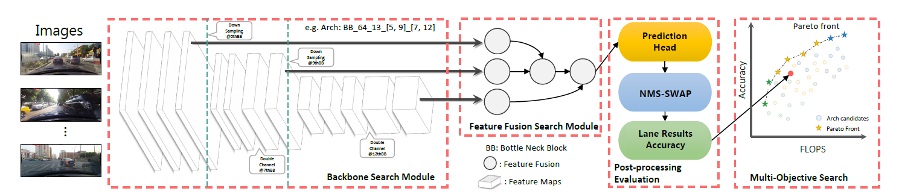
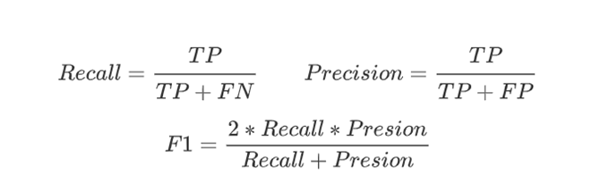

# auto_lane

## 1. Algorithm Introduction

Lane information is the most important information of road structure, which is vital for the intelligent vehicle to drive in the restricted road area. Real-time lane detection is one of the most important procedure in intelligent vehicle assisted driving system work cycle, which is helpful to path planning, lane departure warning and accurate navigation. An end-to-end Lane architecture search algorithm, auto_lane is designed to cope with the problem that with a large amount of calculation overhead current lane detection models are lacking in practical applicable worth. The algorithm architecture is shown below：


auto_lane is composed of three components: backbone module, feature fusion module and head。The backbone module is mainly used to extract image features, feature fusion module is mainly used to fuse multi-level features, and head is used to decode the corresponding lane line. After end-to-end search, multiple candidate models can be obtained to meet the deployment requirements, then they can be selected and deployed according to the actual situation.

## 2. Application scenarios

This Algorithm is mainly designed for the application of automatic driving industry, such as the perception module of auxiliary driving / automatic driving system, AR navigation and high precision map aided drafting, etc.

## 3. Algorithm principle

1. the design of search algorithm

   Gradient-based search method, RL-based search method and EA-based search method are the main stream in the research field. Gradient-based search methods are fast but unreliable, and there is a big gap between search and final training. The RL-based search  methods requiring a large number of samples are inefficient in data utilization, which is not suitable for lane line detection. Auto_Lane uses the EA-based method to search for networks and encodes the network architecture based on experience. The algorithm generates the initial sample by using the random sampling method, the samples located at the Pareto frontier are selected to generate the child sample by using the evolution algorithm and the partial order pruning algorithm, after multiple generation of search, the candidate sample located on the Pareto front edge are obtained.

2. the design of search space

   - the search space of backbone

    The search space of backbone consists of two series: `ResNetVariantDet`and `ResNeXtVariantDet`，The two series have the same coding scheme but different block which is the atom structure of a model, The coding structure is described as follows.

    

    The preceding figure shows the model of  `basicblock 28 121-211-1111-12111`，`basicblock` indicates that the block used by the model is `basicblock`. `-` indicates that the model is divided into different stages based on the resolution. ，`1` indicates that the number of channels is not increased. `2` indicates that the number of channels is doubled.

   - the search space of feature fusion

    Based on experience and the validity of feature fusion, the following four model structures are provided: ['012-022', '012-122', '122-022', and '-']. The hyphen, `-` indicates that the feature fusion module is not used, which regard the output of phase 4 of the model as the input of the head. `['012-022', '012-122', '122-022']` indicates the true type structure. The following figure shows the model structure.

    

    The preceding figure shows the model structure of `012-022`. The detail of code scheme is described in the figure on the right.

3. evaluation function

   We use F1 of evaluation result on data set as evaluation function. Unlike the evaluation of solid object detection, lane is irregularly shaped which is pathological for evaluation. Bit-wise IoU is utilized as measure to judge whether a predict lane hit the ground truth or not. Given the cartesian product between the prediction set and the labeling set, The Kuhn-Munkres Algorithm is used to associate the prediction result with the labeling result. If the IoU of the corresponding pair is greater than 0.5, the association is successful. Otherwise, the association fails. Denote the number of instances that are successfully associated in the test set as TP. Denote the number of positive instances that are not correctly predicted in the test set  as FN. Denote the number of positive instances that are incorrectly predicted in the test set as FP.

    

   Then

    

4. search policy

   We adopt the multi-objective search strategy considering the model efficiency (measured by indicators such as inference time/FLOPs) and model performance (measured by F1) at the same time. Non-dominate sorting is used to construct a Pareto front to obtain a series of network structures optimal for multiple objectives.

## 4. How -to

1. How to run auto_lane

   Before running this algorithm, be sure to read the [Installation Guide] (.. /user/install.md), [Deployment Guide] (.. /user/deployment.md), [Configuration Guide] (.. /user/config_reference.md), [Example reference](.. /user/examples.md) and confirm it.

   The `/nas/auto_lane.yml` configuration file that can be used to run the benchmark is provided here. Go to the `examples` directory and execute the following command to run the example:

    ```bash
    vega ./nas/auto_lane.yml -s b
    ```

2. How to set search algorithm parameter

   The search algorithm is a mixture of random sampling and evolution algorithm, which is controlled by the search_algorithm subtree in the configuration tree. The configuration items are as follows:

   ```yaml
       search_algorithm:
           type: AutoLaneNas        # Set the search algorithm
           codec: AutoLaneNasCodec  # Set the codec to be used
           random_ratio: 0.5        # Set the sampling ratio of random sampling to the total number of samples.
           num_mutate: 10           # Set Genetic Algebra for Genetic Algorithm
           max_sample: 100          # Set the maximum number of samples
           min_sample: 10           # Set the minimum number of samples
   ```

3. How to set search space

     the search space provided by the algorithm composed of `backbone` and `neck`. The specific configurable content is as follows: 

     | component |                  module                  |
     | :-------: | :--------------------------------------: |
     | backbone  | `ResNetVariantDet`,  `ResNeXtVariantDet` |
     |   neck    |          `FeatureFusionModule`           |

     The configuration is determined by the `search_space` and `model` configuration subtree in the configuration file. ：

     ```yaml
    search_space:
        hyperparameters:
            -   key: network.backbone.base_depth
                type: CATEGORY
                range: [18, 34, 50, 101]                     # The value 18, 34 indicates that the basic block is used.The value 50, 101 indicates that the bottleneck block is used
            -   key: network.backbone.type
                type: CATEGORY
                range: [ResNetVariantDet, ResNeXtVariantDet]
            -   key: network.backbone.base_channel
                type: CATEGORY
                range:  [32, 48, 56, 64]                     # Set the basic channel to a multiple of 2.
            -   key: network.neck.arch_code
                type: CATEGORY
                range: ['012-022', '012-122', '122-022','-'] # feature fusion SearchSpace
            -   key: network.neck.type
                type: CATEGORY
                range: [FeatureFusionModule]                 # Set FeatureFusionModule series

    model:
		model_desc:
		    modules: ['backbone','neck']                     # Module to be searched for (Do not modify this item.)
		    backbone:
		        type: [ResNetVariantDet, ResNeXtVariantDet]   # Set the ResNetVariantDet and ResNeXtVariantDet trunk series. This subtree can be deleted if not needed.
		    neck:
		        type: FeatureFusionModule
     ```

4. How to config trainer

     The configuration items of the trainer are as follows:

     ```yaml
     trainer:
         type: Trainer
         save_model_desc: True           # Save the model details
         with_valid: True                # Whether to validate during training
         is_detection_trainer: True      # Set this parameter to True when the algorithm is detection
         callbacks: ['AutoLaneTrainerCallback','DetectionMetricsEvaluator','DetectionProgressLogger']
         report_freq: 50                 # The interval of report(measured by step)
         valid_interval: 3               # The interval of valid(measure by epoch)
         epochs: 40                      # Number of epochs to be trained
         optim:
             type: SGD                   # Set the optimizer to SGD
             lr: 0.02                    # Set the initial learning rate
             momentum: 0.9               # Set the momentum
             weight_decay: 0.0001        # Set the weight_decay
         lr_scheduler:
             type: WarmupScheduler       # Set WarmupScheduler
             params:
                warmup_type: linear         # Set warmup_type
                warmup_iters: 5000          # Set the number of steps of the warmup.
                warmup_ratio: 0.1           # Set the initial learning rate.
                after_scheduler_config:
                    by_epoch: False      # Set WarmupScheduler changes with the step instead of the epoch.
                    type: CosineAnnealingLR # Set the scheduler of the LR.
                    params:
                        T_max: 120000    # int(10_0000/batch_size)*epoch-warmup_iters
         metric:
             type: LaneMetric            # Set the evaluation mode (The evaluation mode of the lane line is special. Do not modify the subtree)
             method: f1_measure          # Set the evaluation indicator to f1_measure
             eval_width: 1640            # Set the image width for the evaluation
             eval_height: 590            # Set the image height for the evaluated
             iou_thresh: 0.5             # Set IoU threshhold
             lane_width: 30              # Set the line width for calculating the bit-wise IoU.
             thresh_list:  [0.50, 0.60, 0.70, 0.80, 0.90] # Perform grid search for the prediction threshhold during evaluation.
     ```

5. How to configure dataset
   The interface of the CULane dataset and the CurveLanes dataset are provided here. After downloaded the correspond dataset to the target place, You can configure and use the dataset.

   Dataset configuration parameters:

   ```yaml
   dataset:
       type: AutoLaneDataset
       common:
           batch_size: 32
           num_workers: 12
           dataset_path: "/cache/datasets/CULane/"
           dataset_format: CULane
       train:
           with_aug: False                       # Set this parameter to True when fullytrain.
           shuffle: True
           random_sample: True
       valid:
           shuffle: False
       test:
           shuffle: False
   ```

## 5. Benchmark

For details, see the benchmark configuration item in the [auto_lane.yml](https://github.com/huawei-noah/vega/blob/master/examples/nas/auto_lane/auto_lane.yml) configuration file.
