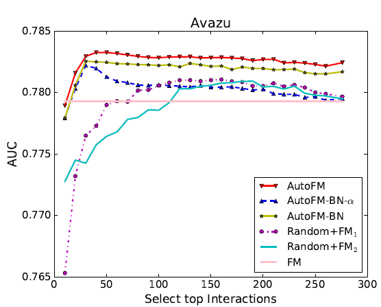

# AutoFIS

## 1. Introduction

AutoFIS is an automatic feature selection algorithm for recommender system scenes. The neural-network-based prediction model of recommender systems (including but not limited to CTR prediction) can be simply divided into three modules, namely Embedding Layer, Interaction Layer and MLP Layer.
Interaction layer is the key module of the whole prediction model, which is designed for modeling the feature interaction effectively.
The existing prediction models are mainly based on FM (factorization machines) for feature interaction modeling. In the second-order case, all the second-order feature interactions are modeled, resulting in O(N^2) feature space.
However, in practice, not all feature interactions are effective, and noise may be involved, which may impair the accuracy of model prediction.
Given this, AutoFIS can automatically learn the effective part of feature interaction from O(N^2) feature space, and shield the redundant interactions through gate function, so as to improve the prediction accuracy. The applicable models for AutoFIS include FM, FFM and deepfm, etc.


## 2. Theory

AutoFIS consists of two phases. In the first stage (search stage), the importance score of each feature interaction is learned by automatic searching; In the second stage (retrain stage), on the basis of the search stage, the unimportant feature interactions are shielded and the model is retrained to achieve better results.



### 2.1 Search Space

For the second-order interaction, the search space of AutoFIS is the whole second-order interaction, namely N*(N-1)/2 interactions. The weight of each second-order feature interaction is learned through the structure parameter `alpha`.
The `alpha` obtained after the model convergence represents the importance of the corresponding feature interaction.

### 2.2 Search Strategy

In terms of the search strategy, the structural parameter `alpha`, which represents the importance of feature interactions, is learned by one-level optimization in the process of model training.

In the search stage, the optimizer gRDA [1] is used to optimize the structure parameter `alpha`, and a sparse solution is learned. The sparse solution can drop most useless feature interactions, and only beneficial feature interactions are left.

In the retrain stage, based on the structural parameter `alpha` obtained from the search stage, AutoFIS gradually blocks the unimportant features interactively and retrains the whole model, so as to further improve the accuracy.

## 3. Guidance

### 3.1 Environment Settings

Setting the parameters in the configuration file, which is located in automl/examples/nas/fis/autogate_grda.yml. Configuration file consists of the following main parts:

```yaml
pipeline: [search, retrain]                    # the pipeline of AutoFIS (two stage)

search:                                        # the search stage of AutoFIS
    pipe_step：                                # the type of pipe_step
    dataset：                                  # the config of dataset
    model：                                    # the config of model parameters and structure
    trainer：                                  # the config of optimizer
    evaluator：                                # the config of evaluator
retrain:                                       # the retrain stage of AutoFIS

```

### 3.2 Dataset Setting

The data used by AutoFIS is a general CTR prediction dataset format, which is represented by sparse matrix and stored as '.npy' files. For example, the feature vector `x = [0,0,0,1,0.5,0,0,0,0,0]` can be represented by these two vectors `feature_id = [3, 4], feature_val = [1, 0.5]`. The first vector represents the ID of non-zero features, and the second vector represents the corresponding values. In many scenarios, `x` is a binary vector. In this case, the `feature_val` is a vector of all 1, which can be omitted.

Here, we take the public dataset Avazu as an example to introduce how to configure:

```yaml
dataset:
    type: AvazuDataset                         # dataset
    batch_size: 2000                           # batch size
    common:
        data_path: /cache/datasets/avazu/      # data path of dataset

```

### 3.3 Model Setting

AutoFIS can be used to select the feature interactions of FM, FFM, DeepFM and other models. Taking DeepFM as an example:

```yaml
model:
    model_desc:
        modules: ["custom"]
            custom:
                type: AutoGateModel            # name of model
                input_dim: 645195              # the number of features of the whole training set, that is, the dimension of the `x` vector
                input_dim4lookup: 24           # the number of non-zero features in a sampler, that is, the dimension of `feature_id` vector
                embed_dim: 40
                hidden_dims: [700, 700, 700, 700, 700]
                dropout_prob: 0.0
                batch_norm: False
                layer_norm: True
                alpha_init_mean: 0.0
                alpha_activation: 'tanh'
                selected_pairs: []             # the default is [], that is, all feature interactions are retained

```

### 3.4 Optimizer Setting

Adam and gRDA optimizers need to be configured in the search phase of AutoFIS. The following describes how to configure:

```yaml
trainer:
    type: Trainer
        callbacks: AutoGateGrdaS1TrainerCallback    # the trainer callback of search stage
        epochs: 1                                   # training epoch
        optim:
            type: Adam
            lr: 0.001
        struc_optim:                                # the parameters of GRDA
            struct_lr: 1                            # the learning rate of GRDA
        net_optim:                                  # the parameters of  Adam
            net_lr: 1e-3                            # the learning rate of Adam
        c: 0.0005                                   # the initial sparse control constant parameters of GRDA
        mu: 0.8                                     # the sparsity control parameters of GRDA
        lr_scheduler:                               # learning rate scheduler
            type: StepLR
            step_size: 1000
            gamma: 0.75
        metric:                                     # evaluate metric AUC
            type: auc
        loss:                                       # loss function BCEWithLogitsLoss
            type: BCEWithLogitsLoss

```

### 3.5 Top-K AutoFIS

The feature interaction selection of AutoFIS is sparse selection through gRDA optimizer. In addition, the top-k optimal feature interactions can be selected directly. The corresponding examples can refer to: `/examples/nas/fis/autogate.yml`

Different from the gRDA version, the top-k version of AutoFIS only needs Adam one optimizer, so the training is more convenient. The model parameters fis_ratio is used to select the scale of feature interaction.

### 3.6 Output

The AutoFIS algorithm will output the best performance of the model and the corresponding model files, including checkpoint and pickle files.
