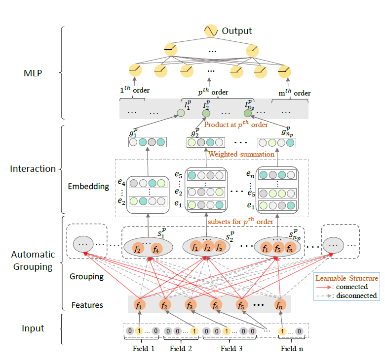

# AutoGroup

## 1. Algorithm Introduction

AutoGroup algorithm is proposed for automatically learn feature interaction for deep recommendation system(DRS), which casts the selection of feature interactions as a structural optimization problem and optimizes it by AutoML techniques.
First, AutoGroup automatically groups important features into many feature sets. Then, it generates given order interactions in each feature set with a novel interaction function. Finally, it feeds all interactions into fully connected layers to further learn implicit feature interactions.

## 2. Algorithm Principles

AutoGroup casts the selection of feature interactions as a structural optimization problem, and use  [Gumbel-Softmax](https://arxiv.org/pdf/1611.01144.pdf) tricks to solve differentiable selections problems.

In training process, AutoGroup respectively train structure parameters for feature selection and other network parameters (network weights). 

Instead of using partial training data to optimize structure parameters and network weights respectively, we use the whole training data to optimize them both.

More specifically, during the training process, we first generate one batch of data. And then this batch training data are used to update network weights. After that, the same data are used to optimize structure parameters. The above optimization strategy works well in our problem.



### 2.1 Search space and strategy

The search space of AutoGroup is selection of feature interactions. In search strategy, use Gumbel-softmax tricks to relax it to  differentiable structure selection problems.

### 2.2 Search space config

```yaml
fully_train:
    pipe_step:
        type: TrainPipeStep

    dataset:
        type: AvazuDatasetNew
        common:
            data_path: /cache/datasets/avazu/

    model:
        model_desc:
            modules: ["custom"]
            custom:
                type: AutoGroupModel
                input_dim: 645195
                input_dim4lookup: 24
                hidden_dims: [1024, 512, 256, 1]
                dropout_prob: 0.0
                batch_norm: False
                layer_norm: False
                max_order: 3
                embed_dims: [40, 60, 100]
                bucket_nums: [15, 130, 180]
                temperature: 0.01
                lambda_c: 0.01
    trainer:
        type: Trainer
        callbacks: AutoGroupTrainerCallback
        epochs: 3
        optim:
            type: Adam
            lr: 0.001
        struc_optim:
            struct_lr: 1e4
        net_optim:
            net_lr: 1e-3
        lr_scheduler:
            type: StepLR
            step_size: 1000
            gamma: 0.75
        metric:
            type: auc
        loss:
            type: BCEWithLogitsLoss

    evaluator:
        type: Evaluator
        host_evaluator:
            type: HostEvaluator
            ref: trainer
```

## 3. Usage Guide

### 3.1 Dataset Configuration

AutoGroup use common ctr prediction dataset, such as Avazu and Criteo, which use sparse matrix to store id as `.npy` file.

For example, feature vector `x = [0,0,0,1,0.5,0,0,0,0,0]` can be represented by two sparse vector,  `feature_id = [3, 4], feature_val = [1, 0.5]`, the feature_id is the non-zero feature index in origin feature vector, and feature val is the value of corresponding index. In most scene, `x` is a binary vector, and `feature_val` is ones-like vector with the same shape as feature_id, and can omit.

In the case of Avazu dataset, the dataset configuration as follows:

```yaml
dataset:
    type: AvazuDataset                    # data type
    common:
        data_path: /cache/datasets/avazu/ # data path
```

type is dataset name, data_path is the location of data.

For detail dataset configuration, see the following configuration file for parameter setting:

 - vega/core/datasets/avazu.py

### 3.2 Model Configuration

AutoGroup algorithm needs hyper-parameter set in config file, and this hyper-parameter can also be searched through ASHA alg.

Model configuration as follows:

```yaml
model:
    model_desc:
        modules: ["custom"]
        custom:
            type: AutoGroupModel              # model name
            input_dim: 645195                 # feature num
            input_dim4lookup: 24              # feature fields num
            hidden_dims: [1024, 512, 256, 1]  # DNN part
            dropout_prob: 0.0                 # dropout rate
            batch_norm: False
            layer_norm: False
            max_order: 3                      # max order interaction in autogroup
            embed_dims: [40, 60, 100]         # embed dimension for each order. 
            bucket_nums: [15, 130, 180]       # feature groups in each order
            temperature: 0.01                 # gumbel-softmax parameter
            lambda_c: 0.01                    # coefficient to p-th order feature self-interaction
```

### 3.3 Trainer Configuration

Basic trainer hyper-parameters must be set for AutoGroup model, which can also be searched by ASHA alg.

Trainer configuration as follows:

```yaml
trainer:
        type: Trainer
        callbacks: AutoGroupTrainerCallback     # trainer callback
        epochs: 1                               # epoch num to run trainning progress
        optim:
            type: Adam                          # optimism type
            lr: 0.001                           # learning rate of Adam
        struc_optim:
            struct_lr: 1e4                      # struct params learning rate
        net_optim:
            net_lr: 1e-3                        # network params learning rate
        lr_scheduler:
            type: StepLR
            step_size: 1000
            gamma: 0.75                         # learning rate decay
        metric:
            type: auc                           # metrics function
        loss:
            type: BCEWithLogitsLoss             # loss function, log-loss for ctr predition
```

In trainer, the most important hyper-params is structure learning rate and network learning rate.

Specially, AutoGroup model train structure params (struct optimizer ) and network params respectively, the learning rate of these two optimizer should set respectively.

### 3.4 Algorithm output

After training AutoGroup model, output include optimal feature interaction selection and trained model weight file.
