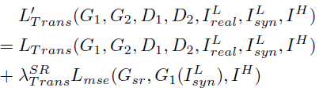

# CycleSR

## 1. Algorithm Introduction

In the typical low level vision tasks, like image super-resolution, it is always difficult to obtain paired data for training in the real scenarios. Synthesized paired data are often used in the academia. The main problem of using synthesized data is that the trained models are not well performed in the real scenario. The distribution of the degraded data, which were originally synthesized, cannot be compared with the real captured data. Image2Image style transfer are now widely used for the image translation from different domains. CycleGAN is the typical unsupervised style transfer algorithms.

CycleSR is an algorithm that can solve the image super-resolution task in the unpaired-data training scenario. This algorithm consists of two parts: transfer network and super-resolution network, and a joint training policy. CycleSR uses the transfer network to generate degraded data that is more suitable for real-world scenarios, paied with HD images to train the super-resolution network.

This algorithm is applicable to most low level vision tasks without the need for paired training data. Users can flexibly change the transfer network and replace the super-resolution network with their own specific models.

**Note: The transfer network can be considered as a data assignment mode in non-paired training scenarios. The subsequent super-resolution network can be replaced with other task specific networks.**

## 2. Algorithm Principles

CycleSR consists of the transfer network and super-resolution network. The following figure shows the network structure.


The overall training process of CycleSR may be divided into the following three steps:

1. Transfer network(CycleGAN): This network can complete the style transfer between two domains. In this case, it is the transfer from the HD domain to the low-resolution domain.
2. Super-resolution network: The low resolution images generated in step 1 and the corresponding HD images form a pair of data for training the super-resolution network.
3. Joint training strategy: The joint training of transfer network and super-resolution network can promote and improve each other's performance. When the generator of the transfer network is updated, the loss of the super-resolution network is involved in the parameter of the update generator. The overall loss of the generator is shown in the following figure.



### 2.1 Network Configuration

There is only one fully train process in the overall cycle SR process. For details about the network configuration, see section examples/data_augmentation/cyclesr/cyclesr.yml, . The process can be divided into the following three parts:

#### transfer Configuration

```yaml
cyclegan:
    input_nc: 3             # Number of input channels
    output_nc: 3            # Number of output channels
    ngf: 64                 # Number of convolution filters of the generator
    ndf: 64                 # Number of convolution filters of the discriminator
    n_layers_D: 3           # Number of convolutional layer of the discriminator
    norm: instance          # Type of normalization
    lambda_cycle: 10.0      # Weight of cycle loss
    lambda_identity: 0.5    # Weight of identity loss
    buffer_size: 50         # Shuffle buffer size
    up_mode: transpose      # Type of upsample
```

The Cycle GAN model file is located in the

```text
vega/networks/pytorch/cyclesrbodys/trans_model.py
```

#### super-resolution network

```yaml
VDSR:
    name: VDSR          # SR network name
    SR_nb: 20           # Number of blocks
    SR_nf: 64           # Number of convolution filters
    SR_norm_type: batch # Normalization mode batch | instance | none
    upscale: 4          # Upsampling factor
    input_nc: 3         # Number of input channels
    output_nc: 3        # Number of output channels
```

The model file of the super-resolution network is stored in the following directory:

```text
vega/networks/pytorch/cyclesrbodys/srmodels.py
```

#### Joint training

```yaml
trainer:
    type: Trainer
    callbacks: CyclesrTrainerCallback
    lazy_built: True
    n_epoch: 100                # Number of epochs to decrease the learning rate
    n_epoch_decay: 100          # Number of epochs that learning rate decreases to 0
    val_ps_offset: 10           # test image offset
    lr_policy: linear           # learning rate type

model:
    model_desc:
        modules: ["custom"]     # Module type
        custom:
            type: CycleSRModel  # Model name
            SR_lam: 1000        # SR loss weight
            cycleSR_lam: 1000   # SR loss weight for updating the cyclegan generator
            grad_clip: 50       # Gradient clip threshold
            cyc_lr: !!float 2e-4    # cyclegan Learning rate
            SR_lr: !!float 1e-4     # SR Network learning rate
```

The network description for joint training is located at

```text
vega/networks/pytorch/cyclesrbodys/cyclesr_net.py
```

## 3. Usage

For details, see the sample code.

The running configuration is located at

```text
examples/data_augmentation/cyclesr/cyclesr.yml
```

## 4. Algorithm Output

1. Log files generated during the training process, including console output and events stored in Writer
2. Trained models
