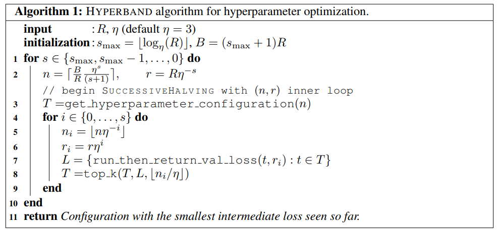
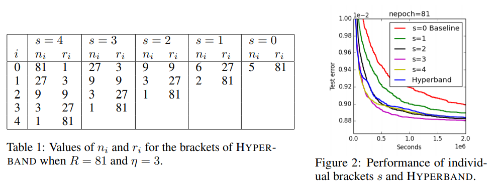

# HPO

## 1. Introduction to hyperparameter optimization Functions

Hyperparameter optimization refers to using automated algorithms to optimize hyperparameters that cannot be optimized through training in original machine learning or deep learning algorithm, such as learning rates, activation functions, and optimizers. When training neural networks, it is necessary to adjust the hyperparameters. This process can more scientifically train more efficient machine learning models. The current model training requires experienced researchers/engineers to determine the hyperparameters to be modified based on the available information, but for most people, this is a time-consuming and laborious process.

With the automatic hyperparameter optimization capability, users can quickly and efficiently test and select the optimal hyperparameter combination in the hyperparameter space, saving a lot of manpower and time. For advanced research users, a more accurate small-scale hyperparametric search space can be defined based on experience and fast hyperparametric search can be performed automatically, thereby further improving the model training effect.

The Vega HPO algorithms are suitable for deep neural network hyperparameter optimization, including single-objective optimization and random Pareto multi-objective hyperparameter selection. The single-objective optimization algorithm is suitable for the situation where the evaluation criteria of the model are unique or the performance of the model can be represented by a single index. The multi-objective Pareto optimization algorithm is suitable for the situation where the model needs to be represented by multi-indicator synthesis.The algorithm finally gives a series of hyperparameter combinations satisfying the Pareto frontier.

Currently, Vega provides the following hyperparameter optimization algorithms:

| algorithm | Single-objective HPO | Multi-objective HPO |
| :--: | :--: | :--: |
| Random | √ | √ |
| ASHA | √ | √ |
| BOHB | √ | √ |
| BOSS | √ | × |
| PBT | √ | × |

## 2. Introduction to Hyperparameter Optimization Algorithms

### 2.1 Hyperparameter Optimization for Deep Neural Network

**Widely used hyperparameter optimization methods:**

1. Grid search
2. Random search
3. Bayesian optimization
4. Dynamic Resource Allocation

### 2.2 Dynamic Resource Allocation

Stochastic gradient descent is a well-known optimization method for neural network training. A batch of learning curves and validation performance can be used to evaluate whether the hyperparameter candidates are good. If the searched hyperparameters are not optimal, we can apply an early-stopping strategy to abort the current training.

**Advantages:**

- Different from traditional random search or bayesian optimization,  dynamic resource allocation method is more suitable for neural network training, which requires multiple iterations, and a huge amount of computing resources. Dynamic resource allocation can find better hyperparameter combinations fast with less computating resource consumption, multiple GPUs can be used to asynchronously search for the optimal hyperparameter combination in parallel.

**Dynamic resource allocation based HPO with early stop policy are as follows:**

- Successive Halving Algorithm (SHA).
- Asynchronous Successive Halving Algorithm (ASHA).
- Bandit-Based Hyperparameter Optimization (HyperBand).
- Hyperband with Bayesian Optimization (BOHB).
- Population Based Training (PBT).

## 3. Introduction to HyperparameterSpace

Currently, Vega provides a general search space that can contains independent discrete or continuous variables, and allows to set the conditional constraint relationship between variables.

The search space supports the following variable types and inter-variable conditional constraints:

1. **Variable Type**

Continuous variables:

- [x] INT
- [x] INT_EXP
- [x] FLOAT
- [x] FLOAT_EXP

Discrete variables:

- [x] INT_CAT
- [x] FLOAT_CAT
- [x] STRING
- [x] BOOL

2. **Condition Constraint Type**

- [x] EQUAL
- [x] NOT_EQUAL
- [x] IN

### 3.1 HyperparameterSpace

HyperparameterSpace is designed based on Hyperparameter and Condition. HyperparameterSpace can be understood as a container that contains multiple hyperparameters and associations. A DAG framework is implemented in the  HyperparameterSpace. When a DAG is created in HyperparameterSpace, a directed acyclic graph (DAG) is generated. A hyperparameter is added with nodes is related to the DAG. A condition is a directed edge with added to the DAG. When a directed edge is added, validity of the current DAG is detected by using a DAG principle. If it is found that a DAG attribute is not met, an error is reported, indicating a directed acyclic characteristic of an association relationship between hyperparameters.

**The most important function of HyperparameterSpace is sampling.** 
Currently, even random sampling is supported. It is mainly used to provide hyperparameter space for random search or Bayesian optimization. The detailed action is as following: First, obtain the range of each hyperparameter (hyperparameters of the category type are mapped to a continuous space of [0,1]). A matrix with shape of n*d is constructed for each hyperparameter based on the number n of samples(the default value is 1000), d is the number of hyperparameters. Rhe sampled matrix is fed into the subsequent search algorithm for searching, the sampled space may be resampled and updated at any time, thereby ensuring randomness and region coverage of the sample.

### 3.2 Hyperparameter

Overall architecture:


Hyperparameter stores the name, type, and range of each hyperparameter and maps the hyperparameter range to a uniform value range that can be calculated. The hyperparameter types mainly used here are EXP and CAT. The EXP parameters are mapped to [0,1] after the log operation. The CAT parameters are mapped to [0,1] with a catogrized discretation. 

### 3.3 Condition


Condition is used to manage relationships between hyperparameters. Each hyperparameter relationship requires a child and a parent, whether a child is selected depends on whether the current value of the parent meets certain conditions.

Currently, the following conditions are provided: EQUAL, NOT_EQUAL, and IN.  A condition_range is used to transfer the value or range of the condition. The details are as follows:

- EQUAL: condition_range can contain only one parent value, the value of parent must be equal to the value of condition_range.
- NOT_EQUAL class: condition_range can contain one or more parent values,  the parent value must be different from all values provided in condition_range.
- IN: If parent is a range/category type, cond_range must contain two values, indicating the minimum and maximum values. If child is selected, the current value of parent must be within the cond_range.

## 4. User Guide

### 4.1 Example

Asha_hpo is an example to show how to use the HPO module. The example contains the configure file: asha.yaml .

#### Configuration file asha.yaml

```yaml
pipeline: [hpo]

hpo:
    search_algorithm:
        type: AshaHpo
        policy:
            total_epochs: 20

    search_space:
        type: SearchSpace
        hyperparameters:
            -   key: dataset.batch_size
                type: CATEGORY
                range: [8, 16, 32, 64, 128, 256]
            -   key: trainer.optimizer.params.lr
                type: FLOAT_EXP
                range: [0.00001, 0.1]
            -   key: trainer.optimizer.type
                type: CATEGORY
                range: ['Adam', 'SGD']
            -   key: trainer.optimizer.params.momentum
                type: FLOAT
                range: [0.0, 0.99]
        condition:
            -   key: condition_for_sgd_momentum
                child: trainer.optimizer.params.momentum
                parent: trainer.optimizer.type
                type: EQUAL
                range: ["SGD"]
```

config_count indicates the total number of hyperparameter combinations for sampling. In the ASHA algorithm, total_epochs indicates the maximum number of epochs for training one model, hyperparameter_space indicates the current hyperparameter search space, the condition part contains the sub-hyperparameters : "sgd_momentum" is selected only when "parent": "optimizer" is set to "SGD".

The following information needs to be configured for the trainer:

```yaml
hpo:
    model:
        model_desc:
            modules: ["backbone"]
            backbone:
                type: ResNet
                depth: 18
                num_class: 10
    trainer:
        type: Trainer
        epochs: 1
        optim:
            type: Adam
            lr: 0.1
        lr_scheduler:
            type: MultiStepLR
            milestones: [75, 150]
            gamma: 0.5
        metric:
            type: accuracy
        loss:
            type: CrossEntropyLoss
```
### 4.2 Output

#### Run Example

Run the following command:

```bash
vega ./hpo/asha/asha.yml
```

#### Score Board

Logs record different sampling rung_id, hyperparameter config_id, running status of the training task corresponding to the ID, and performance score of single-objective optimization, as shown in the following table.

| rung_id | config_id | status              | score    |
| ------- | --------- | ------------------- | -------- |
| 0       | 0         | StatusType.FINISHED | 1.6      |
| 0       | 1         | StatusType.FINISHED | 12.78261 |
| 0       | 2         | StatusType.FINISHED | 1.2208   |
| 0       | 3         | StatusType.FINISHED | 3.198976 |
| 0       | 4         | StatusType.FINISHED | 12.78772 |

#### hps.json

As shown in the following figure, the hyperparameter combination with the highest score is selected under single-objective optimization:

```json
{
    "trainer": {
        "epochs": 1,
        "optimizer": {
            "params": {
                "momentum": 0.8254907348201684,
                "lr": 0.07
            },
            "type": "SGD"
        }
    },
    "dataset": {
        "batch_size": 256
    }
}
```

## 5. Appendix

### 5.1 Introduction to the ASHA Algorithm

<https://arxiv.org/abs/1810.05934>

<https://blog.ml.cmu.edu/2018/12/12/massively-parallel-hyperparameter-optimization/>

Dynamic resource allocation hyper parameter optimization is used in the SHA algorithm, which is the continuous halving algorithm. The basic idea is as follows: Mmultiple groups of hyperparameters are trained in parallel, and a small number of training iteration are taken in each round. All hyperparameters are evaluated and sorted, all training with hyperparameters arranged in the lower half part is stopped early. A next round of evaluation is performed on the remaining hyperparameters. The evaluation is halved again until the optimization objective is reached.


The preceding describes the specific operations and ideas of SHA. The problem is that SHA is a serialized or synchronous parallel operation. The next round can be performed only after all hyperparameter training and evaluation in the same round are complete. The asynchronous and parallel algorithm ASHA is proposed for the training accerlation. It performs the next round of evaluation in the current round and continuously synchronizes the growth process, which can be asynchronous and concurrent, greatly improving optimization efficiency.


### 5.2 HyperBand Algorithm

[Hyperband: Bandit-Based Configuration Evaluation for Hyperparameter Optimization](https://openreview.net/pdf?id=ry18Ww5ee)



- $r$: Budget that can be allocated for a hyperparameter combination;
- $R$: Maximum budget that can be allocated for a hyperparameter combination;
- $s_{max}$: Budget control.
- $B$: Total budget $B=(s_{max}+1)R$；
- $\eta$: Proportion of elimination parameters after each iteration;
- get_hyperparameter_configuration(n): N groups of hyperparameters through sampling;
- run_then_return_val_loss($t$,$r_i$): Valid loss;

**Hyperband example:**

An example on the MNIST dataset is given, and the number of iterations is defined as budget, one budget for each epoch. The hyperparameter search space includes learning rate, batch size, and kernel numbers.

R=81,η=3R=81,η=3, so smax=4,B=5R=5×81smax=4,B=5R=5×81.

The following figure shows the number of hyperparameter groups to be trained and the allocation of hyperparameter resources in each group.



There are two level of loops. The inner loop perform the successive halving, number of hyperparameter combinations used for evaluation decreases at each iteration. Meanwhile, the budget that can be allocated to a single hyperparameter combination increases gradually. Therefore, a proper hyperparameter can be found more quickly in this process.

### 5.3 BOHB Algorithm

BOHB is an efficient and stable parameter modulation algorithm proposed by <https://arxiv.org/abs/1807.01774> . Bayesian Optimization (BO) and Hyperband (HB) algorithms are short for BO and HB.

The BOHB depends on the Hyperband (HB) to determine the number of groups of parameters and the amount of resources allocated to each group of parameters. The improvement is that the method of randomly selecting parameters at the beginning of each iteration is replaced by the means of selecting parameters based on the previous data (Bayesian optimization) for parameter selection. Once the number of parameters generated by Bayesian optimization reaches the number of configurations required for iteration, the standard consecutive halving process is started using these configurations.
The performance of these parameters under different resource configurations (budget), g(x, b), is used as the reference data for selecting parameters in next iterations.

### 5.4 BOSS Algorithms

Bayesian Optimization via Sub-Sampling (BOSS) is a general hyperparameter optimization algorithm based on the Bayesian optimization. It is used to efficiently hyperparameter search under the restricted computing resources setting. The core idea is the adaptive allocation of training resources for hyperparameter combination. The final output of the BOSS algorithm is an hyperparameter combination. Under this combination, an optimal model can be obtained after full training. The search of BOSS is as follows:

1. Select the hyperparameters to be searched and the related value ranges.
2. Randomly select a batch of hyperparameter combinations.
3. For these hyperparameter combinations, the Sub-Sampling algorithm is used to allocate computing resources (the number of iterations of the training neural network or the number of samples of the Monte Carlo method) to obtain the corresponding performance indicators of each combination.
4. The Bayesian model (TPE model) is updated based on the newly added combinations, and the next batch of combinations are extracted from the updated  TPE model.
5. Repeat steps 3-4 until the max iterations are reached or predefined performance is achieved.

### 5.5 TPE Algorithm

TPE is based on Bayesian ideas. Different from GP, TPE simulates p(x|y) instead of p(y|x) in the modeling loss function. See the reference <https://papers.nips.cc/paper/4443-algorithms-for-hyper-parameter-optimization.pdf> for detailed algorithm description.
