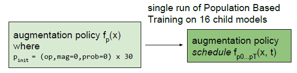
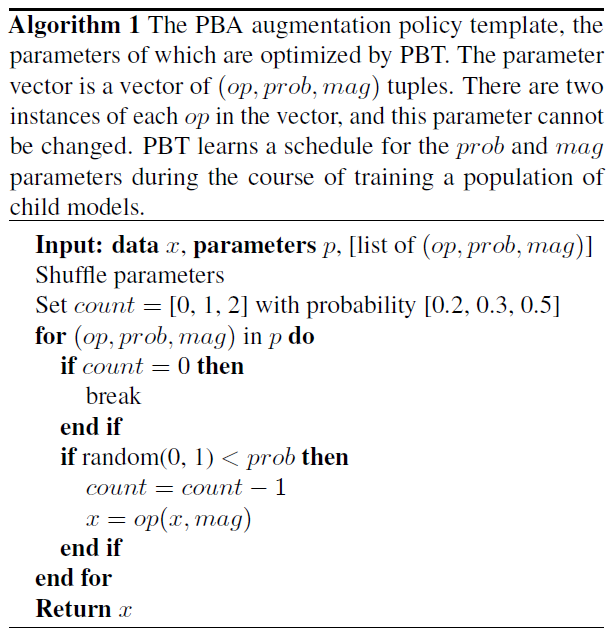

# PBA

## 1. Algorithm Introduction

PBA is an algorithm based on PBT, which is a hyperparameter search algorithm that optimizes both network parameters and hyperparameters. The final output of the PBT algorithm is a trained model and a hyperparameters schedules with optimal performance obtained in the entire search process. In PBA algorithm, we only care about the augmentation policy schedules, and can use it to train different models in the same dataset to get better performance.

The PBA search process is as follows:

1. A fixed population of models are randomly initialized and trained in parallel.
2. At cartain intervals, an "exploit-and-explore" procedure is applied to the worst performing population members, where the model clones the weights of a better performing model and then perturbs the hyperparameters of the cloned model to search in the hyperparameter space.
3. Repeat step 2, until the specified number of epoch rounds is reached.

The current PBA algorithm supports automatic data augmentation in image classification scenarios. It can obtain augmentation policy schedules for the current dataset, which are irrelevant to the specific model and can be used for training different models on the current dataset.

The current PBA algorithm can be applied to datasets of image classification tasks. To use the PBA algorithm, you need to use the Dataset base class in the verga pipeline as the parent class to define the subclasses of your datasets and set related parameters in the configuration file.

## 2. Algorithm Principles

Data augmentation is widely used in the training of neural network models and is an effective technique to improve the accuracy of image classifiers. However, most of the implementations of data augmentation in the past were manually designed. Google was the first to propose AutoAugment to improve data augmentation by automatic search. In AutoAugment, the author designs a search space in which a strategy consists of many sub-strategies, one of which is randomly selected for each single image in each batch. A sub-policy consists of two operations, each of which is an image processing function, such as translation, rotation or clipping. The search algorithm is used to find the best strategy, which makes the neural network produce the highest verifiability on the target dataset.

The traditional AutoAugment algorithm is time-consuming and requires high computing power. Therefore, the research team from Berkeley University proposed the population-based data augmentation strategy (PBA). The PBA algorithm is based on the PBT algorithm. Unlike AutoAugment, the author here takes a contiguous search space, and the search yields augmentation policy schedule that varies with the epoch. In different epochs, the algorithm adopts different data augmentation strategies. The authors said that although the final search space is much larger than AutoAugment, but the final results suggest that augmentation policy schedule is more appropriate. First, if a submodel is incompletely trained, it is difficult to evaluate a fixed strategy. Second, there is reason to believe that augmentation policy schedule can be better searched because of its smoother nature.

The population-based search algorithm is as follows: At the beginning, we set all the threads to random initial values and run them in parallel. Here we use the "exploit-and-explore" procedure for thread updates. Each time, we clone the best thread to the worst thread, and then make some random perturbations on the current hyperparameters of the best thread. Because the worst thread is replaced by the best, and the best thread is locally disturbed. So we can think of this operation as an "exploit-and-explore" procedure.

In PBA, CIFAR10 is used as an example. In CIFAR10, the algorithm extracts a sub-dataset of 4000 samples for searching the augmentation policy schedule and uses 16 models for training. Each thread has an initial data augmentation policy (similar to the AutoAugment algorithm) in the form of (A, P, M), that is, the selected policy, usage probability, and usage strength. Then, the trained model is tested in the validation set every three epochs to obtain a val_acc, that is, validation accuracy. After that, the models are sorted based on the validation accuracy result, and four models with the best performance are used to cover the four models with the worst performance, and each model is randomly disturbed, this process continues for 200 epochs.

The PBA algorithm trains only 16 models, each with 200 epochs. Compared with AutoAugment that needs to search for 16,000 models and 120 epochs, the PBA algorithm greatly improves the time efficiency and obtains the experimental precision that is almost the same as AutoAugment. The following figure shows the PBA algorithm process, data augmentation operation selection policy, and "exploit-and-explore" procedure.

<center>

</center>

<center>

</center>

<center>

</center>

## 3. Search space and search policy

Currently, the PBA supports 15 data augmentation operations by default. According to the algorithm, each operation can be repeated once when the data augmentation operation is selected for each batch of training samples. Each operation has two parameters: probability and strength. Therefore, the search space is defined as a 60-dimensional integer vector.

The search method is the same as that described in the algorithm principle. The PBT algorithm is used for search.

## 4. Configure the search space.

Currently, the PBA algorithm supports the following 15 data augmentation operations:

<center>

</center>

In the configuration file, you can adjust the data augmentation operation involved.

```yaml
pipeline: [hpo]

hpo:
    pipe_step:
        type: SearchPipeStep
    dataset:
        type: Cifar10
    search_space:
        type: SearchSpace
        transformers:
            - Cutout: True
            - Rotate: True
            - Translate_X: True
            - Translate_Y: True
            - Brightness: True
            - Color: True
            - Invert: True
            - Sharpness: True
            - Posterize: True
            - Shear_X: True
            - Solarize: True
            - Shear_Y: True
            - Equalize: True
            - AutoContrast: True
            - Contrast: True

    search_algorithm:
        type: PBAHpo
        policy:
            each_epochs: 3      # Number of epochs to be trained for each trainer round
            config_count: 16    # Number of model groups for parallel training of the search algorithm
            total_rungs: 200    # Number of iterations of the search algorithm 
    trainer:
        type: Trainer
    evaluator:
        type: Evaluator
        host_evaluator:
            type: HostEvaluator
            metric:
                type: accuracy
```

## 5. Result output

The PBA algorithm uses the default parameters in the parameter configuration file in the VEGA pipeline (200 epochs in the search phase and 400 epochs in the fully-train phase) to achieve the same precision as the original algorithm in the CIFAR10 dataset(used wide-resnet-28-10), as shown in the following table.

||Baseline|Cutout|AA|PBA|
|:--:|:--:|:--:|:--:|:--:|
|Ho et at.,2019|96.13%|96.92%|97.32%|97.42%|
|Vega Pipeline|96.26%|97.18%| \ |97.57%|

The final output files and directories are as follows:

```text
output:
    best_hps.json:    best augmentation policy schedule obtained by the PBA algorithm and the ID and score of the search phase
    hps.csv:          ID and score of 16 groups of augmentation policy schedules obtained by the PBA algorithm in the search phase
    score_board.csv:  score and status of each round of iteration of the 16 groups of data augmentation operations obtained in the algorithm search phase.
workers:
    hpo:             The 16 folders are the final results of the 16 groups of models, including the score and model.
        0:
        1:
        ...
        16:
```
