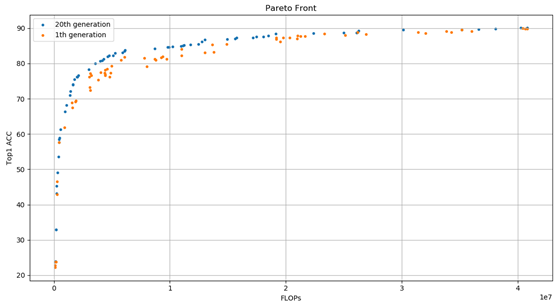

# A Guidance of EA Pruning (PruningEA)

## 1. Algorithm Introduction

The evolution strategy is used to automatically prune channels for network structure compression. The search space is the number of output channels of the convolutional layer to be pruned. A population P including N individuals is maintained, and each individual corresponds to a compressed network model. A population P' of the same size N is generated through cross mutation. Each compressed network performs training/validation, and verifies user-specified optimization objectives (accuracy, FLOPs, parameter quantity, MAC value, and bandwidth) to sort and select individuals, renew the population P.

Take the pruning of a ResNet structure as example. The following figure shows the structure of ResNet-20 which consists of the first convolution kernel and three sequential stages. Each stage consists of three ResBlocks. The shortcut of the first ResBlock connects to two convolutional layer with different numbers of channels, the shortcut consists of the 1x1 upsampling convolution kernel.


 1. Code：

    1.1. Taking 01 encoding on the output channel of convolutional layer to be pruned. The value 0 indicates that the channel is cut, and the value 1 indicates that the channel is reserved.

    1.2. For the convolutional layer that have shortcut connections, ensure that the number of output channels of the two convolutional layer is the same when there is no 1x1 upsampling operation. To facilitate encoding, the numbers of output channels of the two convolutional layer are also the same. We use ch_final to indicate the part number. There are three part numbers in total.

    1.3. For the convolutional layer that do not have shortcut connections, you can prune them randomly, but do not prune them completely. The ch_middle indicates the part number. There are nine part numbers in total.

 2. Search：

    2.1. According to the [search space] determined by coding, generate coding of N compressed models from the population P through an [evolution operation] such as crossover and mutation;

 3. Evaluation：

    3.1. Complete the construction of the compression model based on the N codes generated by the evolution operation.

    3.2 Execute the evaluation process to generate all user-defined evaluation results.

 4. Optimization：

    4.1. Invoke the evolutionary algorithm to update the population P.

Repeat search, evaluation, and optimization processes to complete the automatic pruning process and get the Pareto front. We train the pruned models on Pareto-front to obtain the final performance.

## 2. Usage Guide

### 2.1 Application Scenarios

EA Pruning is used to perform channel pruning for a CNN structure. It consists of two phases: searching for a pruned network and pruned network training. The CNN pruning for image classification is provided as an example.

### 2.2 Operation Description

Configure parameters including searching for the pruned model and training the pruned model are as follows:

- `vega/examples/prune_ea/prune.yml`

The configuration file is directly transferred to the pipeline through main.py. The two phases are performed in sequence. The Pareto front is found during the search process, and the models on front are trained to obtain the final performance.

Prune.yml consists the following sections:

```yaml
nas:
    search_algorithm:           # Evolution algorithm configuration information
        type: PruneEA
        codec: PruneCodec
        policy:
            length: 464         # Total number of channels to be searched
            num_generation: 31  # Evolution algebra
            num_individual: 32  # Number of individuals in each generation
            random_models: 64   # Number of randomly initialized models

    search_space:               # Search space configuration information
        type: SearchSpace
        modules: ['backbone', 'head']
        backbone:
            type: ResNetGeneral
            stage: 3
            base_depth: 20
            base_channel: 16
        head:
            type: LinearClassificationHead
            base_channel: 64
            num_classes: 10
```

### 2.3 Search Space Configuration

Currently, the network that can be pruned is the ResNet series, such as ResNet20, ResNet32, and ResNet56.

```yaml
search_space:       # ResNet20 search space
        type: SearchSpace
        modules: ['backbone', 'head']
        backbone:
            type: ResNetGeneral
            stage: 3
            base_depth: 20
            base_channel: 16
        head:
            type: LinearClassificationHead
            base_channel: 64
            num_classes: 10     # number of categories
```

| | search space | search algorithm |
| --- | --- | --- |
| ResNet-20 | base_depth: 20 | length:464       |
| ResNet-32 | base_depth: 32 | length:688       |
| ResNet-56 | base_depth: 56 | length: 1136     |

### 2.4 Search Algorithm

Pareto front is performed using the NSGA-III multi-objective optimization evolutionary algorithm. For details about the algorithm, see the original paper [1].

[1] Deb, Kalyanmoy, and Himanshu Jain. "An evolutionary many-objective optimization algorithm using reference-point-based nondominated sorting approach, part I: solving problems with box constraints." *IEEE Transactions on Evolutionary Computation* 18.4 (2013): 577-601.

### 2.5 Output Result Description

The following files are generated:

- The model on the found Pareto front after fully training.
- The reports.csv file contains the encoding, flops, parameters, and accuracy of all models during the search process.
- output.csv contains the found pareto front information.

## 3. Benchmark Results

The ResNet20 network is automatically pruned on the CIFAR-10 data set. The test results are as follows:

- In the found Pareto front, the orange part indicates the first-generation Pareto front, and the blue part indicates the 20th-generation Pareto front. As the number of iterations increases, Pareto front moves to the upper left.



- Result of 400 epoch retraining for three models with different pruning ratios on the Pareto front.

  | model | FLOPs | TOP1 Acc | r_c |
  | --- | --- | --- | --- |
  | Baseline | 40.8M  | 91.45 | 1x |
  | IND1 | 30.11M | 91.22 | 0.74x |
  | IND2 | 19.14M | 90.9 | 0.46x |
  | IND3 | 6.14M  | 87.61 | 0.15x |
