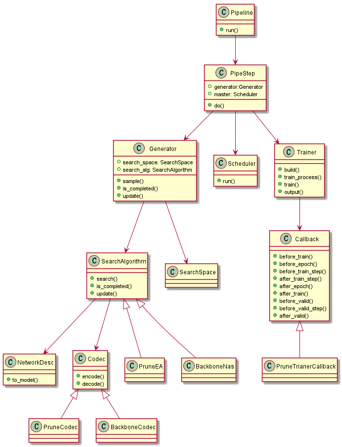

# Development Reference

## 1. Introduction

The key features of Vega are network architecture search and hyperparameter optimization. In the network architecture search process, the search space and search algorithm are the core parts, and the generator is used to control the sampling, update, and end of the search process.

The following figure shows the class diagram of the search space and search algorithm.



The following figure shows the search space and search algorithm process.


Search space process
The following describes the following parts:

- search space
- search algorithm
- Complete NAS search process
- Configuration
- Pipeline
- Trainer and fully train

## 2. Search space

### 2.1 Networks and NetworksFactory

The search space of the Vega NAS includes a series of predefined network types, and a combination of these networks or a construction parameter of each network may be used as the search space of the NAS.

Various network types are defined under vega/search_space/networks, and are classified into backbone, head, RPN, blocks, and super_network based on functions. The backbone refers to the backbone part of the classification or detection network, and the head refers to the output header of the classification or detection network, blocks are basic operations or common modules consisting of basic operations. super_network is a super network commonly used in Parameter Sharing. Custom networks that do not belong to the preceding definition exist.

- search_space
  - netowrks
    - backbones
    - blocks
    - heads
    - rpn
    - super_network
    - customs

The Vega predefined and new network initialization parameters both accept only one parameter in the dict format, which is a complete description of the network. The initialization function parses the description and generates a network model. For Vega, the search space of a network is the value range of the description.

After the network class is defined, register the networks with NetworkFactory according to their types. Take the network registration of ResNet as an example. The code is as follows:

```python
@NetworkFactory.register(NetTypes.BACKBONE)
class ResNet(Network):
    pass
```

As shown in the preceding code, add a registration statement of NetworkFactory before the definition of the ResNet class. Because ResNet belongs to the backbone type, register it as the NetTypes.BACKBONE type.

### 2.2 Configuration Files

After the network class is defined and registered, you need to write the description of the network class construction into the configuration file and provide the optional ranges of some parameters. If the search range of some parameters is not specified in the configuration file, you can leave the description blank. However, the complete parameters must be included in the network description. The following uses the PruneResNet configuration file as an example:

```yaml
search_space:
    type: SearchSpace
    modules: ['backbone']
    backbone:
        type: 'PruneResNet'
        base_chn: [16,16,16,32,32,32,64,64,64]
        base_chn_node: [16,16,32,64]
        num_classes: 10
```

The configuration file does not contain all parameters. The search algorithm needs to calculate and parse these parameters to obtain other parameters before generating the PruneResNet description as the PruneResNet construction parameters. For details, see the example in vega/algorithms/compression/prune_ea.

### 2.3 SearchSpace and NetworkDesc

When the SearchSpace class is initialized, the search_space attribute is loaded as follows:

```python
@ClassFactory.register(ClassType.NETWORK)
class SearchSpace(object):

    config = SearchSpaceConfig()

    def __new__(cls, *args, **kwargs):
        t_cls = ClassFactory.get_cls(ClassType.NETWORK)
        return super(SearchSpace, cls).__new__(t_cls)

    @property
    def search_space(self):
        return self.config.to_dict()
```

Another important concept of the search space is the network description. The network description is the result sampled by the search algorithm from the search space and is a possible subset in the search space. The network description class has only one attribute, that is, the network description of the dict type (one or multiple networks). The network description class has only one general interface to_model(), which is responsible for analyzing the network description and automatically resolving the network description into the specific network object in the Networks through NetworFactory.

```python
class NetworkDesc(object):

    def __init__(self, desc):
        self._desc = Config(deepcopy(desc))
        self._model_type = None
        self._model_name = None

    def to_model(self):
        model = FineGrainedNetWork(self._desc).to_model()
        if model is not None:
            return model
        networks = []
        module_types = self._desc.get('modules')
        for module_type in module_types:
            network = self.to_coarse_network(module_type)
            networks.append((module_type, network))
        if len(networks) == 1:
            return networks[0][1]
        else:
            if vega.is_torch_backend():
                import torch.nn as nn
                networks = OrderedDict(networks)
                return nn.Sequential(networks)
            elif vega.is_tf_backend():
                from .tensorflow import Sequential
                return Sequential(networks)
```

In general, Vega provides a series of network models (added by developers) and registers them with NetworkFactory. Developers need to write the search space of the network model construction parameters in the configuration file, and use the algorithm to sample and generate the network description NetworkDesc. NetworkDesc automatically parses the corresponding network model.

## 3. Search algorithm

The SDK of Vega provides some default search algorithms, such as random search and basic evolution algorithms. Developers can extend the search algorithms as required. These algorithms need to be registered with the unified ClassFactory, and the label is ClassType.SEARCH_ALGORITHM.

There are two parameters for initializing the search algorithm. One is the search_algorithm part in the configuration file, and the other is the object of the SearchSpace class.

The search algorithm provides the following functions:

- Search for a network description net_desc from the search space.
- Update the search algorithm based on the training result.
- Check whether the search process is complete.

The most important of these is the first feature, which is responsible for searching a subset of the SearchSpace objects for a network description.

```python
class SearchAlgorithm(TaskOps):

    def __new__(cls, *args, **kwargs):
        t_cls = ClassFactory.get_cls(ClassType.SEARCH_ALGORITHM)
        return super().__new__(t_cls)

    def __init__(self, search_space=None, **kwargs):
        super(SearchAlgorithm, self).__init__()
        self.search_space = search_space
        self.codec = Codec(search_space, type=self.config.codec)

    def search(self):
        raise NotImplementedError

    def update(self, record):
        pass

    @property
    def is_completed(self):
        raise NotImplementedError
```

Some algorithms (such as EA) may also involve the coding of the search space. Therefore, a codec needs to be implemented in the search algorithm. The codec mainly implements two functions: coding the network description, and decoding the code into the network description.

```python
class Codec(object):
    def encode(self, desc):
        raise NotImplementedError

    def decode(self, code):
        raise NotImplementedError
```

The types and parameters of search algorithms need to be written in the configuration file. The following uses PruneEA as an example:

```yaml
search_algorithm:
    type: PruneEA
    codec: PruneCodec
    policy:
        length: 464
        num_generation: 31
        num_individual: 32
        random_models: 64
```

In the configuration file, you need to define the type of the search algorithm and the parameters of the search algorithm.

## 4. NAS search process

The search process of NAS mainly includes two parts: generator and trainer. The generator samples a network model in the search space by using the search algorithm, initializes the network model as a trainer, and distributes the trainer to nodes for running.

The NAS search process is completed in SearchPipeStep. The main function of SearchPipeStep is completed in the do() function. The code is as follows:

```python
def do(self):
    while not self.generator.is_completed:
        res = self.generator.sample()
        if res:
            self._dispatch_trainer(res)
        else:
            time.sleep(0.5)
        self._after_train(wait_until_finish=False)
    self.master.join()
    self._after_train(wait_until_finish=True)
    ReportServer().output_pareto_front(General.step_name)
    self.master.close_client()
```

In each cycle, the generator first determines whether the search stops. If the search stops, the search ends, the generator is updated, and a value is returned.

If the Trainer object is not stopped, the Generator generates a network model and ID through the sample() function. The ClassFactory locates the specific Trainer class according to the configuration file, and then initializes the Trainer object through the network model and Trainer configuration parameters. The master distributes the trainer to an idle node, obtains the trainer result of the completed node, and then updates the generator, for example, in a loop.

### 4.1 Generator

The generator defines the Search Space and Search Algorithm objects. In each subsequent loop, the Search Algorithm samples a model from the Search Space and initializes the model as the Trainer of the NAS.

This is a standard procedure and does not require additional or reimplementation unless there are special processing steps. The generator implementation code is as follows:

```python
class Generator(object):
    _subclasses = {}

    def __init__(self):
        self.search_space = SearchSpace()
        self.search_alg = SearchAlgorithm(self.search_space.search_space)

    @property
    def is_completed(self):
        return self.search_alg.is_completed

    def sample(self):
        id, desc = self.search_alg.search()
        return id, desc

    def update(self, step_name, worker_id):
        record = reportClinet.get_record(step_name, worker_id)
        logging.debug("Get Record=%s", str(record))
        self.search_alg.update(record.serialize())
```

During initialization, the search space object is generated in the search_space part of the configuration file, and the search space is used as the parameter to initialize the search algorithm object.

The sample interface in the code is used for each sampling in the NAS. The sample interface first invokes the search algorithm to search for a network description, and then generates a network model based on the network description.

In addition, the generator can determine whether the iterative search stops and update the search algorithm.

### 4.2 Quota

Quota is an optional plugin that enables users to define specific rules to control nas search process for special purpose.
Currently, Quota provides avaliable abilities as follows:

- Search control: halt nas search process if reaching user-defined constraints
- Sample filtering: throw away sample from search algorithm if disatisfying user-defined limitations 

The implementation of Quota is show below.

```python
class Quota(object):

    def __new__(cls, *args, **kwargs):
        return super().__new__(cls)

    def __init__(self):
        self.strategies = []
        self.filters = []
        # check whether quota is configured
        pipe_config = UserConfig().data.get(General.step_name)
        if not pipe_config.get('quota'):
            return
        else:
            # get quota configuration
            quota_config = pipe_config.get('quota')
        # get all defined strategies if any
        if quota_config.get('strategy'):
            strategy_types = quota_config['strategy']
            for type_name in strategy_types:
                t_cls = ClassFactory.get_cls(ClassType.QUOTA, type_name)
                self.strategies.append(t_cls())
        # get all defined limitations if any
        if quota_config.get('filter'):
            filter_types = quota_config['filter']
            for type_name in filter_types:
                t_cls = ClassFactory.get_cls(ClassType.QUOTA, type_name)
                self.filters.append(t_cls())

    def halt(self):
        raise NotImplementedError

    def filter(self, res):
        raise NotImplementedError

    def is_halted(self):
        for strategy in self.strategies:
            if strategy.halt():
                return True
        return False

    # check whether some defined filters are satisfied.
    # If reaching constraints, just return false. Otherwise, always return False.
    def is_filtered(self, res=None):
        for flt in self.filters:
            if flt.filter(res):
                logging.info("Sample was throw away by strategy = %s", flt.__class__.__name__)
                return True
        return False
```

While initializing, Quota tries to find whether users set Quota's configuration or not. If setted, Quota gets all user-defined strategies and filters. Quota allows multiple defined rules, and users can give multi rule names in one list. All of the strategies work with a union relationship, which means they make effect at the same time. If not setted, Quota will have nothing influnce on Vega's running.

To take advantage of Quota, there are four steps users should walk with. First, construct a strategy or filter class, which is inherited from Quota base class. Second, overwrite the abstract function of "halt()" and "filter()" to put on users' self-defined approach. Third, regist finished  concrete class into class factory. At the end, add quota configuration setting item into user configuration file, and then Vega will automatically hold on the rest of things.

Here is an configuration example of Quota:

```yml
general:

pipeline: [nas]

nas:
    pipe_step:
        type: SearchPipeStep

    quota:
        strategy: [MaxDurationStrategy, MaxTrialNumberStrategy]
        filter: [FlopParamFliter]
        policy:
            max_duration_time: 3000
            max_trial_num: 300
            flop_range: [!!float 0, !!float 0.6]
            param_range: [!!float 0, !!float 1e10]

```

Quota configuration item is put under the converage of each pipeline, and only has responsibility of each pipeline step, so users need to add Quota setting in each single pipeline step if they want Quota makes effect on different pipeline steps. In Quota's setting paragraph, users can selectively give their own defined strategies and filters by classname which are implemented free and registed into class factory by type "QUOTA". Relavant parameters can be difined into "policy" and refered in strategy class by UserConfig().

```python
class Generator(object):
    """Convert search space and search algorithm, sample a new model."""

    def __init__(self):
        ...
        self.quota = Quota()
        ...
    @property
    def is_completed(self):
        return self.search_alg.is_completed or self.quota.is_halted()

    def sample(self):
        """Sample a work id and model from search algorithm."""
        res = self.search_alg.search()
        if not res:
            return None
        if not isinstance(res, list):
            res = [res]
        if self.quota.is_filtered(res):
            return None
        if len(res) == 0:
            return None
        out = []
        for sample in res:
            if isinstance(sample, tuple):
                sample = dict(worker_id=sample[0], desc=sample[1])
            record = self.record.load_dict(sample)
            logging.debug("Broadcast Record=%s", str(record))
            ReportClient.broadcast(record)
            desc = self._decode_hps(record.desc)
            out.append((record.worker_id, desc))
        return out
```

It should be anounced how Quota works in a round of nas search process. In each nas pipeline step, Vega first check whether the search procedure has completed or arrived at the user-defined halting conditions. If getting to the stop condition, the current nas pipeline step will halt at once.

In proposing samples, after receiving a sample res from search algorithm, the res sample is handed to quota to filter. The filtering rules is defined by users in the function"fliter()" in concrete class. Users can throw away any sample that don't reach their expectation. Afterwards, generator gets all satisfactory samples and go for further processing.

Vega now provides two kinds of halting strategies and one kind of sample filter. The two exisitng halting strategies allow the pipe step to stop by sample trials number and pipe step running time, respectively. These two strategies all support "out of box". The fliter example enables users to remove the sample they don't want by evaluating the flops and parameters of the sample network before training them. Calculating flops and parameters needs to know the dataset's information, so users have to write a "data_case()" interface in related dataset class or just give their own method to compute flops and parameters.

### 5 Trainer

The trainer is used to train models. In the NAS, HPO, and fully train phases, the trainer can be configured in the pipe steps of these phases to complete model training.

The trainer configuration is as follows:

```yaml
trainer:
    type: Trainer
    optim:
        type: SGD
        params:
            lr: 0.1
            momentum: 0.9
            weight_decay: !!float 1e-4
    lr_scheduler:
        type: StepLR
        params:
            step_size: 20
            gamma: 0.5
    loss:
        type: CrossEntropyLoss
    metric:
        type: accuracy
    report_freq: 50
    epochs: 50
```

The standard trainer training process is implemented in the train_process interface. The implementation is as follows:

```python
    def train_process(self):
        self._init_callbacks(self.callbacks)
        self._train_loop()

    def _init_callbacks(self, callbacks):
        self.callbacks = CallbackList(self.config.callbacks, disables)
        self.callbacks.set_trainer(self)

    def _train_loop(self):
        self.callbacks.before_train()
        for epoch in range(self.epochs):
            epoch_logs = {'train_num_batches': len(self.train_loader)}
            if self.do_validation:
                epoch_logs.update({'valid_num_batches': len(self.valid_loader)})
            self.callbacks.before_epoch(epoch, epoch_logs)
            self._train_epoch()
            if self.do_validation and self._should_run_validation(epoch):
                self._valid_epoch()
            self.callbacks.after_epoch(epoch)
        self.callbacks.after_train()
        if self.distributed:
            self._shutdown_distributed()

    def _train_epoch(self):
        if vega.is_torch_backend():
            self.model.train()
            for batch_index, batch in enumerate(self.train_loader):
                batch = self.make_batch(batch)
                batch_logs = {'train_batch': batch}
                self.callbacks.before_train_step(batch_index, batch_logs)
                train_batch_output = self.train_step(batch)
                batch_logs.update(train_batch_output)
                if self.config.is_detection_trainer:
                    batch_logs.update({'is_detection_trainer': True})
                self.callbacks.after_train_step(batch_index, batch_logs)
        elif vega.is_tf_backend():
            self.estimator.train(input_fn=self.train_input_fn,
                                 steps=len(self.train_loader),
                                 hooks=self._init_logging_hook())

    def _valid_epoch(self):
        self.callbacks.before_valid()
        valid_logs = None
        if vega.is_torch_backend():
            self.model.eval()
            with torch.no_grad():
                for batch_index, batch in enumerate(self.valid_loader):
                    batch = self.make_batch(batch)
                    batch_logs = {'valid_batch': batch}
                    self.callbacks.before_valid_step(batch_index, batch_logs)
                    valid_batch_output = self.valid_step(batch)
                    self.callbacks.after_valid_step(batch_index, valid_batch_output)
        elif vega.is_tf_backend():
            eval_metrics = self.estimator.evaluate(input_fn=self.valid_input_fn,
                                                   steps=len(self.valid_loader))
            self.valid_metrics.update(eval_metrics)
            valid_logs = dict()
            valid_logs['cur_valid_perfs'] = self.valid_metrics.results
        self.callbacks.after_valid(valid_logs)
```

The preceding code indicates that the trainer uses the callback mechanism, before_train(), before_epoch(), before_train_step(), after_train_step(), after_epoch(), before_valid(), before_valid_step(), after_valid_step(), and after_valid_step() are inserted during model training. You can customize callback to complete the specific model training process based on the 10 insertion points _valid() and after_train(). 

In addition, Vega provides the default callback function.

- pytorch:ModelStatistics, MetricsEvaluator, ModelCheckpoint, PerformanceSaver, LearningRateScheduler, ProgressLogger, ReportCallback
- TensorFlow:ModelStatistics, MetricsEvaluator, PerformanceSaver, ProgressLogger, ReportCallback

### 5.1 Optimizer

By default, the `torch.optim` in the pytorch library is used. The `type` indicates the used method, and other key values are the input parameters and input parameter values in the method.

```yaml
optim:
    type: SGD
    params:
        lr: 0.1
        momentum: 0.9
        weight_decay: !!float 1e-4
```

### 5.2 Loss

By default, all loss functions under `torch.nn` can be directly used in configuration mode. `type` indicates the used method, and other key values are the values of input parameters and input parameters in the method.

```yaml
loss:
    type: CrossEntropyLoss
```

You can also customize the Loss function and specify it in the configuration.

- Use @ClassFactory.register(ClassType.LOSS) for registration.

```python

@ClassFactory.register(ClassType.LOSS)
class CustomCrossEntropyLoss(Network):
    """Cross Entropy Loss."""

    def __init__(self, desc):
        super(CustomCrossEntropyLoss, self).__init__()
            pass

    def forward(self, **kwargs):
        pass

```

- Reference CustomCrossEntropyLoss in the configuration file.

```yaml
loss:
        type: CustomCrossEntropyLoss
        desc: ~
```

### 5.3 LrScheduler

By default, all lr_scheduler functions in torch.optim.lr_scheduler can be directly used in configuration mode. type indicates the method to be used. Other key values are the values of the input parameters in the method.

```yaml
lr_scheduler:
        type: StepLR
        step_size: 20
        gamma: 0.5
```

Customize an LrScheduler.

- Register with @ClassFactory.register(ClassType.LOSS) and reference it in the configuration file.
- The step interface needs to be implemented. The input parameter is epoch.

```python
@ClassFactory.register(ClassType.LR_SCHEDULER)
class WarmupScheduler(_LRScheduler):
    def step(self, epoch=None):
         pass
```

### 5.4 Metrics

Common metrics are preset in VEGA and can be configured in the configuration file. Multiple metrics can be processed for printing and analysis. When there are multiple metrics, the first metric function is automatically used to calculate the loss.

```yaml
metric:
   type: accuracy
```

Customize a metric.

- Use **@ClassFactory.register(ClassType.METRIC)** for registration.
- Inherited from **zeus.metrics.metrics_base.MetricsBase**
- Specify __metric_name__ for recording and printing metrics.
- Implement the __call__ and **summay** and **reset** methods. The call method is invoked at each step, and the summay method is invoked after each epoch.

```python
@ClassFactory.register(ClassType.METRIC, alias='accuracy')
class Accuracy(MetricBase):

    __metric_name__ = 'accuracy'

    def __init__(self, topk=(1,)):
        self.topk = topk
        self.sum = [0.] * len(topk)
        self.data_num = 0
        self.pfm = [0.] * len(topk)

    def __call__(self, output, target, *args, **kwargs):
        if isinstance(output, tuple):
            output = output[0]
        res = accuracy(output, target, self.topk)
        n = output.size(0)
        self.data_num += n
        self.sum = [self.sum[index] + item.item() * n for index, item in enumerate(res)]
        self.pfm = [item / self.data_num for item in self.sum]
        return res

    def reset(self):
        self.sum = [0.] * len(self.topk)
        self.data_num = 0
        self.pfm = [0.] * len(self.topk)

    def summary(self):
        if len(self.pfm) == 1:
            return self.pfm[0]
        return {'top{}_{}'.format(self.topk[idx], self.name): value for idx, value in enumerate(self.pfm)}
```

In addition, we support unified management of multiple metrics. The metrics class is used to manage various types of metrics of the trainer, and the initialization, calling interfaces, and result obtaining methods of each metric are unified.

- Initialize `Metrics` based on the metric part in the configuration file. The `Metrics` is initialized each time when the value is valid.
- Call `__call__` to calculate the metric and historical average value of each data based on the output data of the network and dataset label data.
- `results` Returns the historical comprehensive result of the metric.

```python
class Metrics(object):

    config = MetricsConfig()

    def __init__(self, metric_cfg=None):
        """Init Metrics."""
        self.mdict = {}
        metric_config = obj2config(self.config) if not metric_cfg else deepcopy(metric_cfg)
        if not isinstance(metric_config, list):
            metric_config = [metric_config]
        for metric_item in metric_config:
            ClassFactory.get_cls(ClassType.METRIC, self.config.type)
            metric_name = metric_item.pop('type')
            metric_class = ClassFactory.get_cls(ClassType.METRIC, metric_name)
            if isfunction(metric_class):
                metric_class = partial(metric_class, **metric_item.get("params", {}))
            else:
                metric_class = metric_class(**metric_item.get("params", {}))
            self.mdict[metric_name] = metric_class
        self.mdict = Config(self.mdict)

    def __call__(self, output=None, target=None, *args, **kwargs):
        pfms = []
        for key in self.mdict:
            metric = self.mdict[key]
            pfms.append(metric(output, target, *args, **kwargs))
        return pfms

    def reset(self):
        for val in self.mdict.values():
            val.reset()

    @property
    def results(self):
        res = {}
        for name, metric in self.mdict.items():
            res.update(metric.result)
        return res

    @property
    def objectives(self):
        return {name: self.mdict.get(name).objective for name in self.mdict}

    def __getattr__(self, key):
        return self.mdict[key]
```

### 5.5 Customizing a Trainer

You can customize the trainer by customizing the callback function. For details about how to implement the callback function, see the default callback function provided by the VEGA.
The following is the implementation of ModelStatistics:

```python
@ClassFactory.register(ClassType.CALLBACK)
class ModelStatistics(Callback):
    def __init__(self):
        super(Callback, self).__init__()
        self.priority = 220

    def before_train(self, logs=None):
        self.input = None
        self.flops = None
        self.params = None
        self.calc_params_each_epoch = self.trainer.config.calc_params_each_epoch
        if vega.is_tf_backend():
            data_iter = self.trainer.valid_input_fn().make_one_shot_iterator()
            input_data, _ = data_iter.get_next()
            self.input = input_data[:1]

    def after_train_step(self, batch_index, logs=None):
        try:
            if self.input is None:
                input, target = logs['train_batch']
                self.input = torch.unsqueeze(input[0], 0)
        except Exception as ex:
            logging.warning("model statics failed, ex=%s", ex)

    def after_epoch(self, epoch, logs=None):
        if self.calc_params_each_epoch:
            self.update_flops_params(epoch=epoch, logs=logs)

    def after_train(self, logs=None):
        if not self.calc_params_each_epoch:
            self.update_flops_params(logs=logs)

    def update_flops_params(self, epoch=None, logs=None):
        self.model = self.trainer.model
        try:
            if self.flops is None:
                flops_count, params_count = calc_model_flops_params(self.model, self.input)
                self.flops, self.params = flops_count * 1600 * 1e-9, params_count * 1e-3
            summary_perfs = logs.get('summary_perfs', {})
            if epoch:
                summary_perfs.update(
                    {'flops': self.flops, 'params': self.params, 'epoch': epoch})
            else:
                summary_perfs.update({'flops': self.flops, 'params': self.params})
            logs.update({'summary_perfs': summary_perfs})
        except Exception as ex:
            logging.warning("model statics failed, ex=%s", ex)
```

## 6. Configuration

The Vega Configuration uses the registration mechanism. All registered classes can be invoked using the following methods:

```python
_cls = ClassFactory.get_cls(class_type, class_name)
install = _cls(params)
```

In addition, Vega can dynamically map the configuration in the configuration file to the corresponding instance based on the class type, so that developers and users can directly use the `config` attribute without being aware of the process of loading and parsing the configuration file.

For example, the configuration file of the NAS phase of the Prune-EA algorithm is as follows:

```yaml
nas:
    pipe_step:
        type: SearchPipeStep

    dataset:
        type: Cifar10
        common:
            data_path: /cache/datasets/cifar10/
            train_portion: 0.9
        test:
            batch_size: 1024

    search_algorithm:
        type: PruneEA
        codec: PruneCodec
        policy:
            length: 464
            num_generation: 31
            num_individual: 32
            random_models: 64

    search_space:
        type: SearchSpace
        modules: ['backbone']
        backbone:
            name: 'PruneResNet'
            base_chn: [16,16,16,32,32,32,64,64,64]
            base_chn_node: [16,16,32,64]
            num_classes: 10

    trainer:
        type: Trainer
        callbacks: PruneTrainerCallback
        epochs: 1
        init_model_file: "/cache/models/resnet20.pth"
        optim:
            type: SGD
            params:
                lr: 0.1
                momentum: 0.9
                weight_decay: !!float 1e-4
        lr_scheduler:
            type: StepLR
            params:
                step_size: 20
                gamma: 0.5
        seed: 10
        limits:
            flop_range: [!!float 0, !!float 1e10]
```

In the trainer, the code for obtaining the dataset and lr_scheduler is as follows:

```python
    dataset_cls = ClassFactory.get_cls(ClassType.DATASET)
    dataset = dataset_cls(mode=mode)
    search_alg_cls = ClassFactory.get_cls(ClassType.SEARCH_ALGORITHM)
    search_alg = search_alg_cls(search_space)
```

As shown in the preceding figure, you do not need to specify the class name. Vega scans the configuration file to determine the current pipe step and finds the class name and parameters based on the class type for classFactory to return the correct class definition.
For details about the pipestep definition supported by Vega, see [Configuration Reference](../user/config_reference.md)

## 7. pipeline

The pipeline of Vega implements concatenation of multiple `pipesteps' by loading the `config` configuration. When you run the `vega.run('config.yml')` command, the `_init_env(cfg_path)` method is executed to load the configuration, then the `Pipeline().run()` function is invoked to run the `do()` function of the `pipestep` according to the definition in the configuration file.

In config.yml, `pipleline` is used to define the execution sequence of `pipestep`. In the following example, `pipeline: [nas, fullytrain]` indicates that the `pipestep` of the `nas` node is executed first, and then the `pipestep` of the `fullytrain` node is executed.

```yaml
pipeline: [nas, fullytrain]

nas:
    pipe_step:
        type: SearchPipeStep

fullytrain:
    pipe_step:
        type: TrainPipeStep
```

### 7.1 Report

A pipeline contains multiple steps. Data can be transferred between these steps through the Report. The Report collects the training process data and evaluation results of each step in real time. In addition, the Report data is saved to files in real time.

The Report provides the following interfaces. During model training, the `broadcast()` interface needs to be invoked to save the training result. The search algorithm can invoke the `pareto_front()` interface to obtain the evaluation result. These two interfaces are the most commonly used interfaces.
The trainer has integrated the report scheduling function. After training and evaluation, the trainer automatically calls the report interface to collect the result data for the search algorithm.

```python
@singleton
class ReportServer(object):

    @property
    def all_records(self):

    def pareto_front(self, step_name=None, nums=None, records=None):

    @classmethod
    def close(cls, step_name, worker_id):


class ReportClient(object):

    @classmethod
    def get_record(cls, step_name, worker_id):

    @classmethod
    def broadcast(cls, record):
```

### 7.2 Extend `pipestep`

Currently, the following `pipesteps' have been preset:

* SearchPipeStep
* TrainPipeStep
* BechmarkPipeStep

To extend `pipestep`, inherit the base class `PipeStep` and implement the `do()` function. For details, see the implementation code of the preceding class.

```python
class PipeStep(object):

    def do(self):
        """Do the main task in this pipe step."""
        pass
```

## 8. Fully Train

On `Fully Train`, we support single-card training and multi-device multi-card distributed training based on `Horovod`. `Fully Train` corresponds to `TrainPipeStep` in `pipeline`.

### 8.1 Configuration

If you need to perform `Horovod` distributed training, add the configuration item `distributed` to the `trainer` configuration file of `TrainPipeStep` and set it to `True`. If this configuration item is not added, the default value is False, indicating that distributed training is not used.

```yaml
fullytrain:
    pipe_step:
        type: TrainPipeStep
    trainer:
        type: trainer
        distributed: True
```

The `shell` is used to start the `Horovod` distributed training. The communication between different nodes has been configured in the image. Developers do not need to care about how the `vega` is started internally.

### 8.2 Distributed Horovod Supported by Trainers

In distributed training, the network model, optimizer, and data loading of the `trainer` need to be encapsulated into distributed objects using the `Horovod`.

During the training, the code of single-card training is almost the same as that of distributed training. However, during the final calculation of verification indicators, the indicator values on different cards need to be combined to calculate the total average value.
