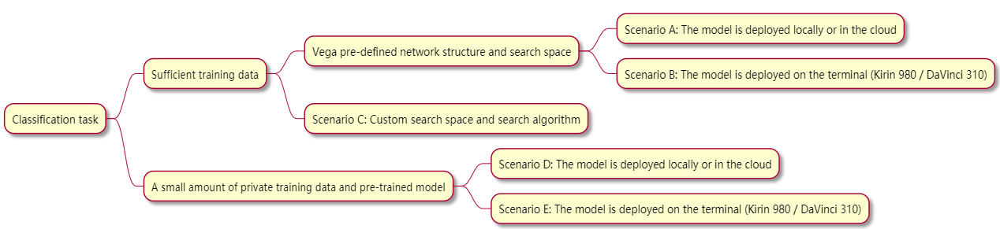

# Classification

## 1. Introduction

Manually designed deep learning networks are widely used in image classification tasks. With the deepening of AutoML research, especially the emergence of various intelligent terminals, higher requirements have been placed on network design, making more and more image classification tasks use automatic learning to build a network.

The general classification task aims at the difference in the use of data sets, there are the following scenarios:

1. Use public data sets to search and train models to verify and compare algorithm performance.
2. There are sufficient private training data, search and training models for classification.
3. Use a small number of private training data sets, use the image classification pre-training model in the model zoo, and expect to achieve a higher model performance.

For the above three scenarios, Vega has provided support. In particular, the use of private data in Vega needs to be adapted according to Vega's interface requirements. You can refer to [Dataset Reference](../developer/datasets.md)

There are the following constraints on the deployment of classification models:

1. The model is deployed on the cloud and has extreme requirements on the accuracy of the model.
2. The model is deployed on specific devices, such as mobile phones and terminal devices using the DaVinci 310 chip. The model needs to be small enough, the reasoning time is short enough, and it must meet a certain accuracy rate.

Vega currently supports these two types of constraints. It can generate multiple models through network architecture search, automatically select the appropriate model for selection, and support the evaluation of model performance on specific hardware devices to meet the requirements.

In addition, for algorithm research researchers, they are not satisfied with the network structure, search space and search algorithm provided by Vega, and hope to search and train the classification model through custom network structure, search space and search algorithm. For such scenarios, Vega also provides support.

## 2. Algorithm selection

The image classification scenarios include:

The following describes how to use Vega to search and train models in these scenarios:

### 2.1 Scenario A: Use sufficient training data to search and train models deployed locally or in the cloud

This scenario only requires the user to provide enough training data, and configure the pipeline according to the following steps to complete the model search and training:

1. Use the NAS search algorithm to search the network architecture and output alternative networks. The search algorithm can try to use one of the three BackboneNAS, CARS, DartsCNN, prefer BackboneNAS algorithm, the algorithm is based on ResNet, simple to set up, can be used for larger data sets.
2. Use HPO to determine the model training parameters. The network can choose one from the networks output by the NAS in the first step. This step will output the network training hyperparameters. The HPO algorithm can use BOSS, BOHB, ASHA, etc., and the BOSS algorithm is preferred.
3. Use the data augmentation algorithm to select the transform, it is recommended to use the PBA algorithm.
4. The last step is fully train, using the alternative network searched by NAS, hyperparameters searched by HPO, and data augmentation search transforms as the input of fully train, train a set of models, and select the best model.

For specific configuration information, please refer to [Configuration Guide](../user/config_reference.md)

### 2.2 Scenario B: Use sufficient training data to search and train the model deployed on the terminal

The key to this scenario is to search the model under certain constraints to facilitate deployment on a specific terminal. The steps are as follows:

1. Use the NAS search algorithm to search the network architecture and output alternative networks. The search algorithm can try to use one of BackboneNAS, CARS, DartsCNN. Generally, in this scenario, the model is small, and the CARS algorithm can be selected first. The algorithm has high execution efficiency and simple settings, and is suitable for the search of small models.
2. In the NAS search phase, the performance of the searched model on specific hardware should be considered. The evaluation service can be configured to convert the model to specific hardware in the model search to evaluate its delay. (To be provided)
3. Use HPO to determine the model training parameters. The network can select one from the networks output by the NAS in the first step. This step will output the network training hyperparameters. The HPO algorithm can use BOSS, BOHB, ASHA, etc., and the BOSS algorithm is preferred.
4. Use the data augmentation algorithm to select the transform, the PBA algorithm is recommended.
5. The final step is fully train, which uses the NAS search alternative network, HPO search hyperparameters, and data augmentation search transforms as fully train input, trains a set of models, and selects the optimal model.

For specific configuration information, please refer to [Configuration Guide](../user/config_reference.md)

### 2.3 Scenario C: Custom search space and search algorithm

The steps suggested in this scenario are as follows:

1. Use the NAS search algorithm to search the network architecture and output alternative networks. The search algorithm can try to use one of BackboneNAS, CARS, DartsCNN. Generally, in this scenario, the model is small, and the CARS algorithm can be selected first. The algorithm has high execution efficiency and simple settings, and is suitable for the search of small models.
2. In the NAS search phase, the performance of the searched model on specific hardware should be considered. The evaluation service can be configured to convert the model to specific hardware in the model search to evaluate its delay. (To be provided)
3. Use HPO to determine the model training parameters. The network can select one from the networks output by the NAS in the first step. This step will output the network training hyperparameters. The HPO algorithm can use BOSS, BOHB, ASHA, etc., and the BOSS algorithm is preferred.
4. Use the data augmentation algorithm to select the transform, the PBA algorithm is recommended.
5. The final step is fully train, which uses the NAS search alternative network, HPO search hyperparameter, and data augmentation search transforms as fully train input, trains a set of models, and selects the optimal model.

### 2.4 Scenario C: Use pre-trained models and a small amount of training data to search and train models used locally or in the cloud

In this scenario, the `EfficientNet B8` model provided in Vega’s [Model Zoo](../model_zoo/model_zoo.md) can be considered, and a small amount of training data is used for fine tuning, which will not be detailed here.

### 2.5 Scenario C: Use a pre-trained model and a small amount of training data to search and train the model used in the terminal

In this scenario, consider the `EfficientNet B8` model provided in [Model Zoo](../model_zoo/model_zoo.md) of Vega, use a small amount of training data for fine tuning, and then consider using pruning (to be provided) And quantitative methods (to be provided) to miniaturize the model and use the model evaluation service for model evaluation, which will not be described in detail here.

## 3. pipeline

After selecting the algorithm according to the scenario, the next step is to construct the pipeline, configure the pipeline configuration file, and vega runs according to the configuration file.
Please refer to [Configuration Reference](../user/config_reference.md) to complete the configuration of the pipeline, which will not be detailed here.
